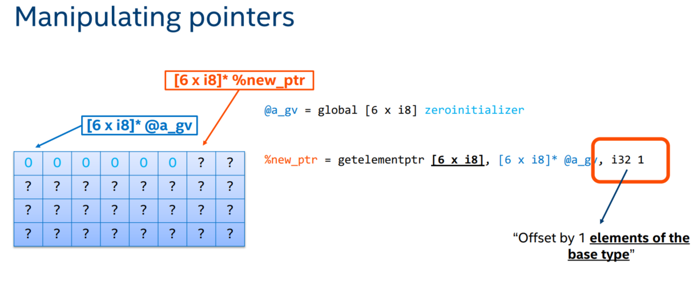
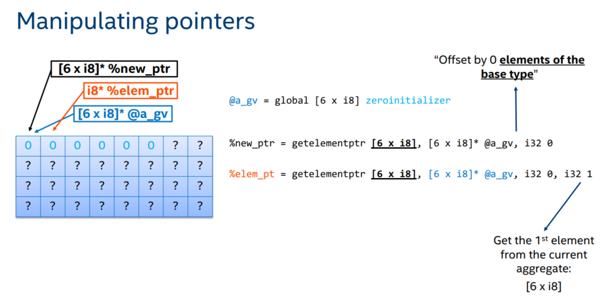
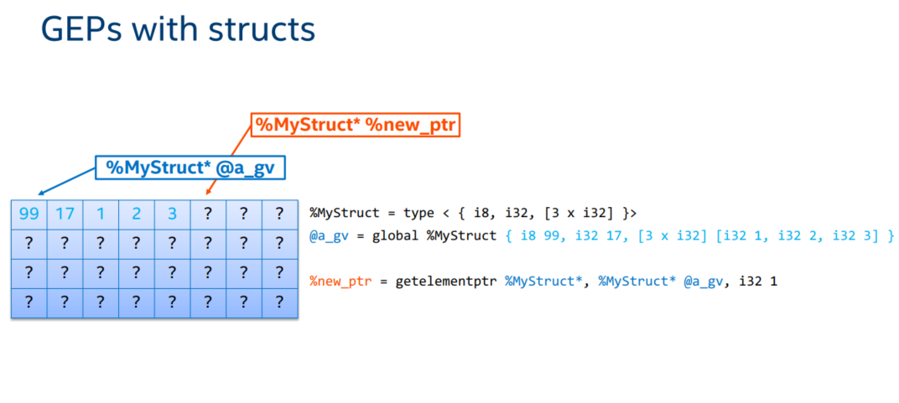
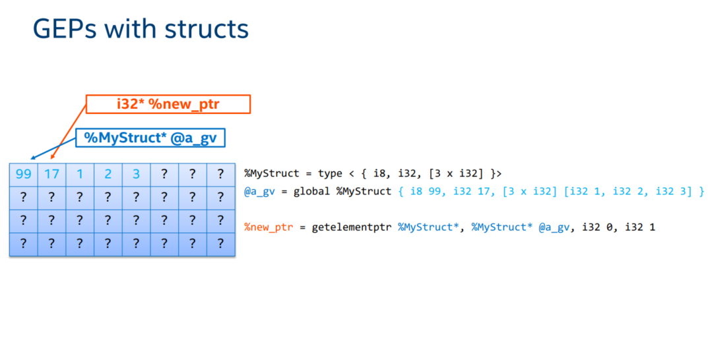
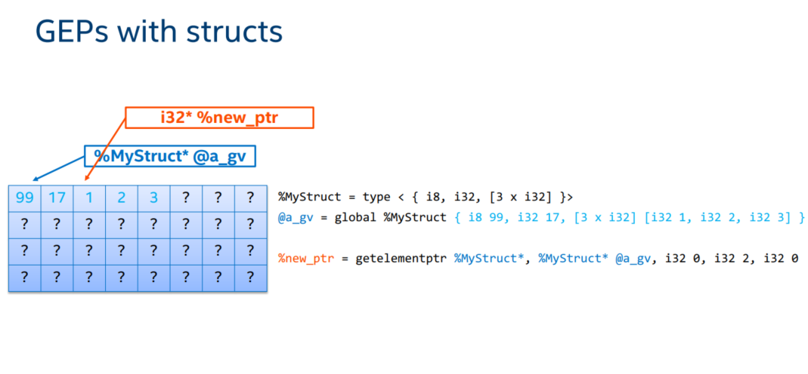

# 内容概要
1. IR的全局变量
1. IR中的Aggregate Types
1. `getelementptr`指令的使用

# 参考文献
1. [LangRef](https://llvm.org/docs/LangRef.html)


# 1. 全局变量
IR中的全局变量定义了一块在编译期分配的内存区域，其类型是一个指针，跟指令`alloca`的返回值用法一样。我们看一下一段使用全局变量简单的C代码对应的IR是什么样子
```C
// a.c
static const int a=0;
const int b=1;
const int c=1;
int d=a+1;
```
` `
```llvm
; a.ll
@b = dso_local constant i32 1, align 4
@c = dso_local constant i32 1, align 4
@d = dso_local global i32 1, align 4
```
前面已经讲过`dso_local`是一个Runtime Preemption,表明该变量会在同一个链接单元内解析符号，`align 4`表示4字节对齐。`global`和`constant`关键字都可以用来定义一个全局变量，全局变量名必须有`@`前缀，因为全局变量会参与链接，所以除去前缀外，其名字会跟你用C语言定义时的相同。

因为我们定义变量`a`时使用了C语言的`static`关键字，也就是说`a`是local to file的，不参与链接，因此我们可以在生成的IR中可以看到，其被优化掉了。
```C
// b.c
extern const int b;
extern const int c;
extern const int d;

int f() {
  return b*c+d;
}
```
` `
```llvm
; b.ll
@b = external dso_local constant i32, align 4
@c = external dso_local constant i32, align 4
@d = external dso_local constant i32, align 4

define dso_local i32 @f() #0 {
entry:
  %0 = load i32, i32* @b, align 4
  %1 = load i32, i32* @c, align 4
  %mul = mul nsw i32 %0, %1
  %2 = load i32, i32* @d, align 4
  %add = add nsw i32 %mul, %2
  ret i32 %add
}
```
从函数`f`的IR可以看到，全局变量其实是一个指针，在使用其时需要`load`指令（赋值时需要`store`指令）。那`gloal`和`constant`有什么区别呢？`constant`相比`global`，多赋予了全局变量一个const属性（对应C++的底层`const`的概念，表示指针指向的对象是一个常量）。

跟C/C++类似，IR中可以在定义全局变量时使用`global`，而在声明全局变量时使用`constant`，表示该变量在本文件内不改变其值。

我们可以使用` opt -S --globalopt <filename>`命令对全局变量进行优化
```sh
$ opt -S --globalopt a.ll -o a-opt.ll
```
```llvm
@b = dso_local local_unnamed_addr constant i32 1, align 4
@c = dso_local local_unnamed_addr constant i32 1, align 4
@d = dso_local local_unnamed_addr global i32 1, align 4
```
可以看到优化过，全局变量前多了`local_unnamed_addr `的attribute, 该属性表明在这个module内，这个变量的地址是不重要的，只要关心它的值就好。有什么作用呢？譬如说这里`b`和`c`都是常量且等于1，又有`local_unnamed_addr `属性，编译器就可以把`b`和`c`合并成一个变量。

## 2. Aggregate Types
这里我们使用英文Aggregate Types主要是想跟C++的Aggregate Class区分开。IR的Aggregate Types包括数组和结构体。
### 2.1 数组
### 语法
```
[<elementnumber> x <elementtype>]
```
### 概述
跟C++的模板类`template<class T, std::size_t N > class array`类似，数组元素在内存中是连续分布的，元素个数必须是编译器常量，未被提供初始值的元素会被零初始化，只是下标的使用方式有点区别。
### Example
```llvm
@array = global [17 x i8] ; 17个i8都是0
%array2 = alloca [17 x i8] [i8 1, i8 2] ; 前两个是1、2，其余是0
%array3 = alloca [3 x [4 x i32]] ; 3行4列的i32数组
@array4 = global [2 x [3 x [4 x i16]]] ; 2x3x4的i16数组
``` 
## 2.2 结构体
### 语法
```llvm
%T1 = type { <type list> }     ; Identified normal struct type
%T2 = type <{ <type list> }>   ; Identified packed struct type
```
### 概述
与C语言中的`struct`相同，不过IR提供了两种版本，normal版元素之间是由padding的，packed版没有。
### Example
```llvm
%struct1 = type { i32, i32, i32 } ; 一个i32的triple
%struct2 = type { float, i32 (i32) * } ; 一个pair，第一个元素是float，第二个元素是一个函数指针，该函数有一个i32的形参，返回一个i32 
%struct3 = type <{ i8, i32 }> ; 一个packed的pair，大小为5字节
```
## 2.3 `getelementptr`指令（GEP）
我们可以使用 `getelementptr`指令来获得指向数组的元素和指向结构体成员的指针。
### 语法
```llvm
<result> = getelementptr <ty>, <ty>* <ptrval>{, [inrange] <ty> <idx>}*
<result> = getelementptr inbounds <ty>, <ty>* <ptrval>{, [inrange] <ty> <idx>}*
```
### 概述
第一个`ty`是第一个索引使用的基本类型，第二个`ty`表示其后的基址`ptrval`的类型，`inbounds`和`inrange`关键字的含义这里不讲，有兴趣可以去[LangRef](https://llvm.org/docs/LangRef.html#i-getelementptr)查阅。
`<ty> <idx>`是第一组索引的类型和值，`<ty> <idx>`可以出现多次，其后出现的就是第二组、第三组等等索引的类型和值。要注意索引的类型和索引使用的基本类型是不一样的，索引的类型的一般是`i32`或者`i64`，而索引使用的基本类型确定的是增加索引值时指针的偏移量。

### GEP的几个要点
#### 理解第一个索引
1. 第一个索引不会改变返回的指针的类型，也就是说`ptrval`前面的`<ty>*`对应什么类型，返回就是什么类型
1. 第一个索引的偏移量的是由第一个索引的值和第一个`ty`指定的基本类型共同确定的。

下面看个例子



上图中第一个索引所使用的基本类型是`[6 x i8]`，值是1，所以返回的值相对基址`@a_gv`前进了6个字节。由于只有一个索引，所以返回的指针也是`[6 x i8]*`类型。
#### 理解后面的索引
1. 后面的索引是在 Aggregate Types内进行索引
1. 每增加一个索引，就会使得该索引使用的基本类型和返回的指针的类型去掉一层

下面看个例子



我们看`%elem_ptr = getelementptr [6 x i8], [6 x i8]* @a_gv, i32 0, i32 0`这一句，第一个索引值是0，使用的基本类型`[6 x i8]`, 因此其使返回的指针先前进0 x 6 个字节，也就是不前进，第二个索引的值是1，使用的基本类型就是`i8`（`[6 x i8]`去掉左边的6），因此其使返回的指针前进一个字节，返回的指针类型为`i8*`（`[6 x i8]*`去掉左边的6）。

### GEP如何作用于结构体


只有一个索引情况下，GEP作用于结构体与作用于数组的规则相同，`%new_ptr = getelementptr %MyStruct*, %MyStruct* @a_gv, i32 1`使得`%new_ptr`相对`@a_gv`偏移一个结构体`%MyStruct`的大小。



在有两个索引的情况下，第二个索引对返回指针的影响跟结构体的成员类型有关。譬如说在上图中，第二个索引值是1，那么返回的指针就会偏移到第二个成员，也就是偏移1个字节，由于第二个成员是`i32`类型，因此返回的指针是`i32*`。


如果结构体的本身也有Aggregate Type的成员，就会出现超过两个索引的情况。第三个索引将会进入这个Aggregate Type成员进行索引。譬如说上图中的第二个索引是2，指针先指向第三个成员，第三个成员是个数组。再看第三个索引是0，因此指针就指向该成员的第一个元素，指针类型也变成了`i32*`。
> 注：GEP作用于结构体时，其索引一定要是常量。GEP指令只是返回一个偏移后的指针，并没有访问内存。