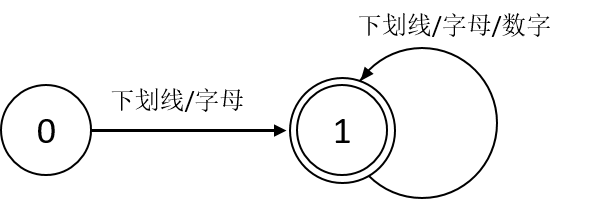

# 内容概要
1. 编译系统所支持的C语言子集介绍
1. 编译器的基本结构
1. 确定有限状态自动机（DFA）的定义
1. 词法分析器的结构
1. 扫描器(Scanner)和词法分析器(Lexer)的实现
1. [完整代码的Github Repo链接](https://github.com/Mr-Awakened/Build-Your-Own-Compile-System)

# 参考文献
1. <<自己手动构造编译系统>>
1. [Deterministic finite automaton](https://en.wikipedia.org/wiki/Deterministic_finite_automaton)
1. [how to clone all remote branches in git](https://stackoverflow.com/questions/67699/how-to-clone-all-remote-branches-in-git)
1. [Google C++ Code Style](https://google.github.io/styleguide/cppguide.html)
1. [clang-format](https://clang.llvm.org/docs/ClangFormat.html)
1. [Using Printf with Modern C++](https://msdn.microsoft.com/en-us/magazine/dn913181.aspx)
1. [Error: format string is not a string literal](https://stackoverflow.com/questions/32362918/error-format-string-is-not-a-string-literal?rq=1)
1. [define global variable in namespace](https://stackoverflow.com/questions/8317010/how-to-declare-and-define-global-variables-in-order-to-access-them-from-all-head)
1. [C/C++的二进制字面值](https://stackoverflow.com/questions/15114140/writing-binary-number-system-in-c-code)
1. <<跟我一起写Makefile>>
1. `Ctrl + v + tab` 在vim中强制输入tab（不转化为空格）
1. [Really clear the terminal](https://askubuntu.com/questions/25077/how-to-really-clear-the-terminal) `clear && printf '\e[3J'`


# 1. 要实现的语言
在实现编译器之前，必须弄清楚编译器要处理什么样的语言，本系列文章所要撸的编译器想处理的是**C语言的子集**。词法记号是高级语言代码的基本单位，因此，**C**语言作为一门高级语言，其代码也是词法记号按照一定规则的组合。

词法记号通常可以分为标识符、关键字、常量、界符(界符包含分隔符、运算符、空白符)四大类，高级语言的定义对词法记号的定义有直接影响。不同语言对标识符的定义不同，如**Visual Basic**不区分标识符的大小写**C**语言区分标识符的大小写；不同语言的关键字表也不尽相同，如在**C** 语言内不存在**C++** 的`virtual`关键字；不同语言的界符定义不同，**PASCAL**的赋值运算符为 `:=`，而**C**语言的赋值运算符为`=`。

我们所要支持的C语言子集如下：
## 1.1 类型系统
支持`int`, `char`, `void`基本类型和一维指针、一维数组类型。涉及的词法记号有关键字`int`, `char`, `void`。
## 1.2 常量
支持字符常量、字符串常量、2/8/10进制整数。涉及的词法记号有字符常量、字符串常量、数字常量(e.g. `'c'`、`"Hello"`、`12`)。
## 1.3 运算符
支持加、减、乘、除、取模、取负、自加、自减算术运算；大于、大于等于、小于、小于等于、等于、不等于关系运算；或、与、非逻辑运算；赋值运算符，指针解引用运算符，取地址运算符，数组索引运算符。涉及的词法记号有`+`, `-`, `*`, `/`, `%`, `-`, `++`, `--`, `>`, `>=`, `<`, `<=`, `==`, `!=`, `&&`, `||`, `!`, `=`, `*`, `&`, `[`, `]`。注意，乘法运算符和指针解引用运算符是同一个词法记号，减法运算符和取负运算符是同一个词法记号。
## 1.4 控制结构
支持`do-while`, `while`, `for`循环；`if-else`, `switch-case`条件分支；函数调用, `return`, `break`, `continue`语句。涉及的词法记号有`do`, `while`, `for`, `if`, `else`, `switch`, `case`, `default`, `return`, `break`, `continue`。
## 1.5 声明与定义
支持`extern`变量声明，函数声明，变量、函数定义。涉及的词法记号有`extern`, `(`, `)`，注意小括号也可能用来改变运算的结合顺序。
## 1.6 分隔符
复合语句或函数体需要使用花括号包含起来，函数参数以逗号分隔，基本语句以分号结束，`case`和`default`关键字后使用冒号分割。涉及的词法记号有`{`, `}`, `,`, `;`, `:`。
## 1.7 其他
支持默认类型转换，单行和多行注释等。默认类型的转化属于代码生成部分的内容，注释不是有效的词法记号。不过除了以上提到的词法记号之外，还需要引入两个特殊的词法记号。`err`表示词法分析出错时返回的词法记号，词法分析器和语法分析器都会自动忽略这个词法记号；`end`表示文件结束。

# 2. 编译器的结构
编译器是编译系统的核心，主要负责解析源程序的语义，生成汇编代码。一般情况下，编译流程包含词法分析、语法分析、语义分析和代码生成四个阶段。符号表管理和错误贯穿整个编译流程。如果编译器支持代码优化，那么还需要优化器模块。


# 3. 词法分析


词法分析时编译器处理流程中的第一步，它顺序扫描源文件内的字符，识别出各式各样的词法记号。为了理解这个过程，我们需要介绍一下 **确定有限状态自动机(DFA)** 的概念。
## 3.1 确定有限状态自动机（DFA）
DFA从起始状态开始，一个字符接一个字符地读入字符串，并根据给定地转移函数一步一步地转移至下一个状态。在读完改字符串后，如果该DFA停在一个接受状态，它就接受该字符串，反之则拒绝该字符串。

不难想到，对于一个给定的DFA，存在一个唯一的状态转换图与之对应。譬如说，下面的状态转换图就可以表示识别C语言标识符的DFA


## 3.2 词法分析器（Lexer）的结构
词法分析器（Lexer）可以分解成两个部分，从源文件按序扫描字符的为扫描器（Scanner）,与有限自动机进行匹配产生词法记号的功能称为解析器。


## 3.3 扫描器的实现
本系列文章会采用[Google C++ Code Style](https://google.github.io/styleguide/cppguide.html)作为代码风格，使用[clang-format](https://clang.llvm.org/docs/ClangFormat.html)作为格式化工具。

扫描器使用80字节长度的缓冲区，每次先尝试从缓冲区读取字符，当缓冲区为空时，从源文件内加载续保的80字节到缓冲区，这样可以减少耗时的磁盘I/O操作。
```cpp
#pragma once
#include "error.h"
#include <memory>
#include <string>

namespace akan {
class Scanner {

  static void CloseFile(std::FILE *fp) {
    if (fp) {
      std::fclose(fp);
    }
  }
  // File
  const char *file_name_ = nullptr;
  std::unique_ptr<FILE, decltype(CloseFile) *> file_;

  // Characters read
  static constexpr int buf_len_ = 80; // Length of scan buffer
  char line_[buf_len_];

  // Read status
  int line_len_ = 0;  // Length of current line
  int read_pos_ = -1; // Read position
  char last_ch_ = 0;  // Last character, used to judge the line break position
  int line_num_ = 1;  // Row Number
  int col_num_ = 0;   // Column Number

  // Debug helper
  static std::string ShowChar(char ch) {
    char s[16];
    switch (ch) {
    case -1:
      std::sprintf(s, "%s <%d>", "EOF", ch);
      break;
    case '\n':
      std::sprintf(s, "%s <%d>", "\\n", ch);
      break;
    case '\t':
      std::sprintf(s, "%s <%d>", "\\t", ch);
      break;
    case ' ':
      std::sprintf(s, "%s <%d>", "blank", ch);
      break;
    default:
      std::sprintf(s, "%c <%d>", ch, ch);
    }
    return std::string(s);
  }

public:
  Scanner(const char *name)
      : file_name_(name), file_(std::fopen(name, "r"), &CloseFile) {
    if (!file_) {
      PrintCommonError(
          FATAL, "Fail to open the file %s! Please check filename and path.\n",
          name);
      Error::IncrErrorNum();
    }
  }

  Scanner(const Scanner &) = delete;
  Scanner &operator=(const Scanner &) = delete;
  ~Scanner() = default;

  // Scan characters from  buffer
  int Scan() {
    if (!file_)
      return -1;
    if (read_pos_ == line_len_ - 1) {
      line_len_ = fread(line_, 1, buf_len_, file_.get()); // reload buffer data
      if (line_len_ == 0) {                               // no data
        // indicate end of file
        line_len_ = 1;
        line_[0] = -1;
        last_ch_ = -1;
        return -1;
      }
      read_pos_ = -1; // restore reading position
    }
    ++read_pos_;
    char ch = line_[read_pos_]; // get the new char
    if (last_ch_ == '\n') {     // start new line
      ++line_num_;
      col_num_ = 0;
    } else {
      ++col_num_;
    }
    last_ch_ = ch;
    return ch;
  }

  // Getter
  const char *GetFile() const { return file_name_; }
  int GetLine() const { return line_num_; }
  int GetCol() const { return col_num_; }

private:
  static void TestImpl(const char *file_name) {
    Scanner scanner(file_name);
    char ch;
    do {
      ch = scanner.Scan();
      std::printf("%8s\tline: %3d\tcol: %3d\n", ShowChar(ch).c_str(),
                  scanner.GetLine(), scanner.GetCol());
    } while (ch != -1);
    std::printf("Finish the scan for %s\n", file_name);
  }

public:
  static void MainTest(int argc = 0, char *argv[] = nullptr) {
    TestImpl("file/arithmetic.c");
  }
};
} // namespace akan
```
## 3.4 词法分析器的实现
```cpp
#pragma once
#include "error.h"
#include "scanner.h"
#include "token.h"
#include <cctype>
#include <memory>
#include <string>

namespace akan {
class Lexer {
private:
  std::shared_ptr<Scanner> scanner_;
  char ch_ = ' ';
  std::shared_ptr<Token> token_;

  void SkipWhiteSpace() {
    while (ch_ == ' ' || ch_ == '\n' || ch_ == '\t') {
      ch_ = scanner_->Scan();
    }
  }

  bool Scan(char need) {
    ch_ = scanner_->Scan();
    if (ch_ == need)
      return true;
    else
      return false;
  }

  bool IsHexChar(char ch) {
    return std::isdigit(ch) || (ch >= 'A' && ch <= 'F') ||
           (ch >= 'a' && ch <= 'f');
  }

  void Scan() {
    ch_ = scanner_->Scan();
    return;
  }

  void TokenizeIdentifierOrKeywords() {
    std::string name;
    do {
      name.push_back(ch_);
      // Eat one more character here
      ch_ = scanner_->Scan();
    } while (std::isalpha(ch_) || ch_ == '_');
    if (Keyword::IsKeyword(name)) {
      token_ = std::make_shared<Keyword>(name);
    } else {
      token_ = std::make_shared<Identifier>(name);
    }
    return;
  }

  void TokenizeString() {
    std::string str;
    while (!Scan('"')) {
      if (ch_ == '\\') {
        Scan();
        switch (ch_) {
        case 'n':
          str.push_back('\n');
          break;
        case '\\':
          str.push_back('\\');
          break;
        case 't':
          str.push_back('\t');
          break;
        case '"':
          str.push_back('"');
          break;
        case '0':
          str.push_back('\0');
          break;
        case '\n':
          break;
        case -1:
          // Eat one more character here
          Error::PrintLexicalError(STR_NO_R_QUOTE);
          token_ = std::make_shared<Token>(ERR);
          return;
        default:
          str.push_back(ch_);
        }
      } else if (ch_ == '\n' || ch_ == -1) {
        // Eat one more character here
        Error::PrintLexicalError(STR_NO_R_QUOTE);
        token_ = std::make_shared<Token>(ERR);
        return;
      } else {
        str.push_back(ch_);
      }
    }
    token_ = std::make_shared<String>(str);
    // Eat one more character here
    Scan();
  }

  void TokenizeNumber() {
    int val = 0;
    // Decimal
    if (ch_ != 0) {
      do {
        val = val * 10 + ch_ - '0';
        // Eat one more character here
        Scan();
      } while (std::isdigit(ch_));
    } else {
      Scan();
      // Hexadecimal
      if (ch_ == 'x') {
        Scan();
        if (IsHexChar(ch_)) {
          do {
            val = val * 16 + ch_;
            if (std::isdigit(ch_))
              val -= '0';
            else if (ch_ >= 'A' && ch_ <= 'F')
              val += 10 - 'A';
            else if (ch_ >= 'a' && ch_ <= 'f')
              val += 10 - 'a';
            // Eat one more character here
            Scan();
          } while (IsHexChar(ch_));
        } else {
          // Eat one more character here
          Error::PrintLexicalError(HEX_NUM_NO_ENTITY);
          token_ = std::make_shared<Token>(ERR);
          return;
        }
      }
      // Binary
      else if (ch_ == 'b') {
        Scan();
        if (ch_ >= '0' && ch_ <= '1') {
          do {
            val = val * 2 + ch_ - '0';
            // Eat one more character here
            Scan();
          } while (ch_ >= '0' && ch_ <= '1');
        } else {
          // Eat oone more character here
          Error::PrintLexicalError(BI_NUM_NO_ENTITY);
          token_ = std::make_shared<Token>(ERR);
          return;
        }
      }
      // Octal
      else if (ch_ >= '0' && ch_ <= '7') {
        do {
          val = val * 8 + ch_ - '0';
          // Eat one more character here
          Scan();
        } while (ch_ >= '0' && ch_ <= '7');
      }
    }
    token_ = std::make_shared<Number>(val);
  }

  void TokenizeCharacter() {
    Scan();
    char c;
    // Escape character
    if (ch_ = '\\') {
      Scan();
      if (ch_ == 'n')
        c = '\n';
      else if (ch_ == '\\')
        c = '\\';
      else if (ch_ == 't')
        c = '\t';
      else if (ch_ == '0')
        c = '\0';
      else if (ch_ == '\'')
        c = '\'';
      // End of file or line break
      else if (ch_ == -1 || ch_ == '\n') {
        // Eat one more character here
        Error::PrintLexicalError(CHAR_NO_R_QUOTE);
        token_ = std::make_shared<Token>(ERR);
        return;
      }
      // Non-escape character
      else
        c = ch_;
    } else if (ch_ == -1 || ch_ == '\n') {
      // Eat one more character here
      Error::PrintLexicalError(CHAR_NO_R_QUOTE);
      token_ = std::make_shared<Token>(ERR);
      return;
    }
    // No entity
    else if (ch_ == '\'') {
      // Eat one more character here
      Error::PrintLexicalError(NOT_SUPPORT_NULL_CHAR);
      token_ = std::make_shared<Token>(ERR);
      return;
    }
    // Non-escape character
    else {
      c = ch_;
    }
    if (Scan('\'')) {
      token_ = std::make_shared<Character>(c);
      // Eat one more character here
      Scan();
      return;
    } else {
      // Eat one more character here
      Error::PrintLexicalError(CHAR_NO_R_QUOTE);
      token_ = std::make_shared<Token>(ERR);
      return;
    }
  }

  void TokenizeDelimiter() {
    switch (ch_) {
    // Ignore  macro
    case '#':
      while (ch_ != '\n' && ch_ != -1)
        // Eat one more character here
        Scan();
      break;
    case '+':
      token_ = std::make_shared<Delimiter>(Scan('+') ? INC : ADD);
      // Eat one more character here
      Scan();
      break;
    case '-':
      token_ = std::make_shared<Delimiter>(Scan('-') ? DEC : SUB);
      // Eat one more character here
      Scan();
      break;
    case '*':
      token_ = std::make_shared<Delimiter>(MUL);
      // Eat one more character here
      Scan();
      break;
    case '/':
      Scan();
      // Single-line comment
      if (ch_ == '/') {
        while (ch_ != '\n' && ch_ != -1) {
          // Eat one more character here
          Scan();
        }
        // make pointer null if match a comment
        token_ = nullptr;
        return;
      }
      // Multi-line comment
      else if (ch_ == '*') {
        while (!Scan(-1)) {
          if (ch_ == '*') {
            if (Scan('/'))
              break;
          }
        }
        if (ch_ == -1) {
          // Eat one more character here
          Error::PrintLexicalError(COMMENT_NO_END);
          token_ = std::make_shared<Token>(ERR);
          return;
        } else {
          // Eat one more character here
          Scan();
          // make pointer null if match a comment
          token_ = nullptr;
          return;
        }
      }
      // Division operator
      else {
        token_ = std::make_shared<Delimiter>(DIV);
        // Eat one more character here
        Scan();
        return;
      }
    case '%':
      token_ = std::make_shared<Delimiter>(MOD);
      // Eat one more character here
      Scan();
      break;
    case '>':
      token_ = std::make_shared<Delimiter>(Scan('=') ? GE : GT);
      // Eat one more character here
      Scan();
      break;
    case '<':
      token_ = std::make_shared<Delimiter>(Scan('=') ? LE : LT);
      // Eat one more character here
      Scan();
      break;
    case '=':
      token_ = std::make_shared<Delimiter>(Scan('=') ? EQU : ASSIGN);
      // Eat one more character here
      Scan();
      break;
    case '&':
      token_ = std::make_shared<Delimiter>(Scan('&') ? AND : LEA);
      // Eat one more character here
      Scan();
      break;
    case '|':
      if (Scan('|')) {
        token_ = std::make_shared<Delimiter>(OR);
        // Eat one more character here
        Scan();
        return;
      } else {
        token_ = std::make_shared<Token>(ERR);
        // Eat one more character here
        Error::PrintLexicalError(OR_NO_PAIR);
        return;
      }
    case ',':
      token_ = std::make_shared<Delimiter>(COMMA);
      // Eat one more character here
      Scan();
      break;
    case ':':
      token_ = std::make_shared<Delimiter>(COLON);
      // Eat one more character here
      Scan();
      break;
    case ';':
      token_ = std::make_shared<Delimiter>(SEMICON);
      // Eat one more character here
      Scan();
      break;
    case '(':
      token_ = std::make_shared<Delimiter>(LPAREN);
      // Eat one more character here
      Scan();
      break;
    case ')':
      token_ = std::make_shared<Delimiter>(RPAREN);
      // Eat one more character here
      Scan();
      break;
    case '[':
      token_ = std::make_shared<Delimiter>(LBRACK);
      // Eat one more character here
      Scan();
      break;
    case ']':
      token_ = std::make_shared<Delimiter>(RBRACK);
      // Eat one more character here
      Scan();
      break;
    case '{':
      token_ = std::make_shared<Delimiter>(LBRACE);
      // Eat one more character here
      Scan();
      break;
    case '}':
      token_ = std::make_shared<Delimiter>(RBRACE);
      // Eat one more character here
      Scan();
      break;
    case -1:
      token_ = std::make_shared<Token>(END);
      break;
    default:
      token_ = std::make_shared<Token>(ERR);
      // Eat one more character here
      Error::PrintLexicalError(TOKEN_NO_EXIST);
    }
  }

public:
  Lexer(std::shared_ptr<Scanner> scanner) : scanner_(scanner) {
    Error::SetScanner(scanner);
  }
  Lexer(const Lexer &) = delete;
  Lexer &operator=(const Lexer &) = delete;
  ~Lexer() = default;
  // All Tokenize function should eat one more character except that an error
  // occurs or scanner reaches the end of the file.
  std::shared_ptr<Token> Tokenize() {
    // Use a loop here is to skip the comment and print out all lexical error.
    do {
      SkipWhiteSpace();
      if (std::isalpha(ch_) || ch_ == '_')
        TokenizeIdentifierOrKeywords();
      else if (ch_ == '"')
        TokenizeString();
      else if (std::isdigit(ch_))
        TokenizeNumber();
      else if (ch_ == '\'')
        TokenizeCharacter();
      else
        TokenizeDelimiter();
      if (token_ && token_->GetTag() != ERR)
        return token_;
    } while (ch_ != -1);
    return std::make_shared<Token>(END);
  }

private:
  // Debug helper
  static void TestImpl(const char *file_name) {
    Lexer lexer(std::make_shared<Scanner>(file_name));
    std::shared_ptr<Token> token;
    do {
      token = lexer.Tokenize();
      std::printf("%10s\t", Token::GetTagName(token->GetTag()).c_str());
      std::fflush(stdout);
      std::printf("%20s\n", token->ToString().c_str());
      std::fflush(stdout);
    } while (token->GetTag() != END);
    std::printf("Finish the lex for %s\n", file_name);
  }

public:
  static void MainTest(int argc = 0, char *argv[] = nullptr) {
    TestImpl("file/arithmetic.c");
    printf("\n");
    TestImpl("file/intended_error.c");
  }
};
} // namespace akan
```
# 完整代码链接
[Build-Your-Own-Compile-System](https://github.com/Mr-Awakened/Build-Your-Own-Compile-System)