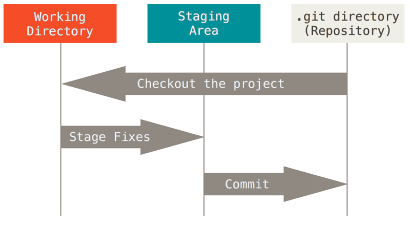
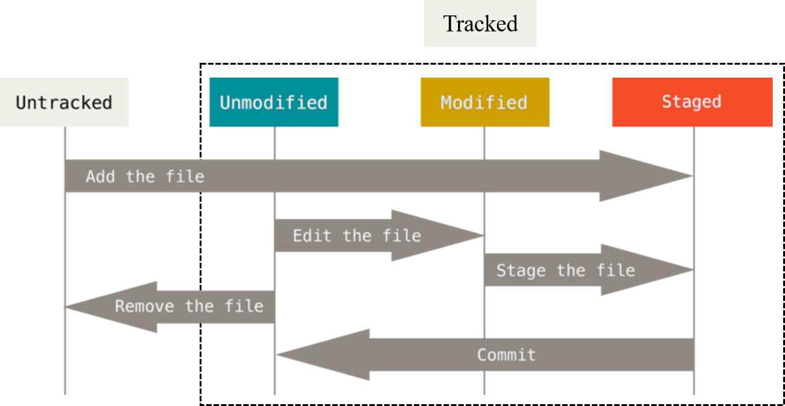
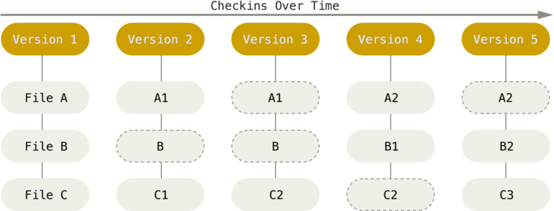
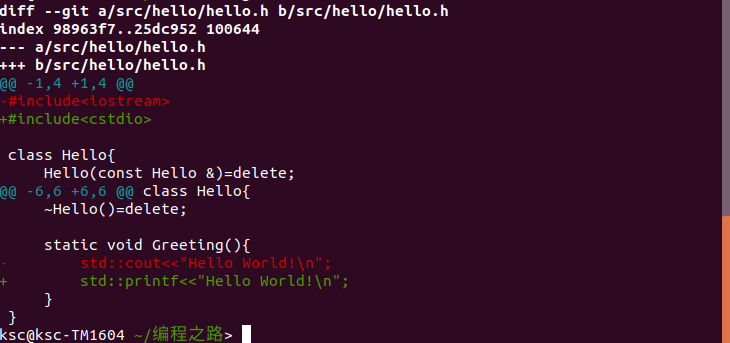

# 内容概要
# 参考文献
1. Pro Git
1. [git diff命令输出解读-阿里云社区](https://yq.aliyun.com/articles/658560)
1. [git rm --cached <file>与git reset HEAD -- <file>的区别](https://stackoverflow.com/questions/5798930/git-rm-cached-x-vs-git-reset-head-x)

# 1. Git起步
Git是什么呢？简单的说，Git是一个**分布式版本控制系统（Distributed Version Control System，DVCS）**，用于跟踪软件开发过程中源码的变化。“分布式”表明在写代码时多个程序员可以互相协作，“版本控制”表明它并不是仅仅保存了仓库最新的版本哦，仓库的整个“前世今生”，也就是变更历史，都记在了它的小本本上（Git版本库）。

Git是怎么诞生的呢？2002年，Linux内核开源项目组开始免费使用一个叫BitKeeper的DVCS来管理代码，2005年呢不给免费用了，Linux开源社区就开发出了Git.

# 2. Git的工作原理


我们称.git文件夹为Git版本库，称开发的项目和.git文件夹共同所在的父目录为工作目录。
## 2.1 Git中文件的状态
基本的Git工作流程如下:

1. 在工作目录中修改文件。
1. 暂存文件(git add)，将文件的快照放入暂存区域。（其实就是Git版本库下的一个文件，保存了下次将提交的文件列表信息）
1. 提交更新(git commit)，找到暂存区域的文件，将快照永久存储到Git版本库。

我们先将Git中的文件分为两大状态：**已跟踪的(tracked)**和**未跟踪的(untracked)**。已跟踪的文件是指在暂存区域或者Git版本库中的文件，这些文件已被纳入了版本控制。两个地方都不在的文件就是未跟踪的文件。

根据Git的工作流程的三个步骤，可以将**已跟踪的文件**再划分为3个状态：未修改(unmodified)、已修改(modified)、已暂存(staged)。三个状态的切换周期如下。


## 2.2 Git中快照的含义
Git中的快照是什么意思呢？在你每次暂存文件时，Git对已修改的文件直接拷贝，对未修改的文件保存一个之前存储文件的链接（可以更高效），这就是快照的概念。



上图给出了项目随时间改变的快照，当文件发生了修改时（相对于上次暂存文件），我们在文件名后添加/修改整数后缀表示文件被修改了（文件名实际并没有变），如Version1中的A在Version2中变成了A1；我们用虚线框出没有被修改的文件，如Version2中的B。

值得注意的是，上述过程都是本地执行，所有暂存、提交造成的版本更新都记录在本地的Git版本库。而git push、get fetch等需要跟Github在线仓库打交道的命令才需要连接服务器。

# 3. Git实战
我们为编程之路专栏创建一个工作目录，以后所有的文章的离线版（md文件）包括相关的代码和资源文件都会放在该目录下。
## 3.1 创建工作目录和初始化仓库
```sh
$ mkdir 编程之路;cd 编程之路
$ git init
```
## 3.2 忽略文件
列出工作目录下的文件
```sh
$ ls
Git学习.md*  rc/  README.md  src/  Ubuntu-18.04安装与配置.md
```
其中，*rc*是存放资源文件的文件夹，*src*是存放代码的文件夹，*Git学习.md*是本文的离线版。在本次写作过程中，*rc*下存放的图片会不断增加，*.md*也会不断被修改，在写作完成之前，我们不希望其纳入Git的管理。在这种情况下，我们可以创建一个名为.gitignore的文件，列出要忽略的文件。
```sh
$ cat .gitignore
/rc
*.md
```
## 3.3 暂存和取消暂存文件
将所有文件放入暂存区（不包括要忽略的文件）
```sh
$ git add .
```
检查一下文件状态
```sh
$ git status
On branch master
No commits yet
Changes to be committed:
  (use "git rm --cached <file>..." to unstage)
	new file:   .gitignore
```
可以看到此次只暂存了*.gitignore*。那可以手动暂存被忽略的文件吗？我们试一下，
```sh
$ git add *.md -f
$ git status
On branch master
No commits yet
Changes to be committed:
  (use "git rm --cached <file>..." to unstage)
	new file:   .gitignore
	new file:   "Git学习.md"
	new file:   README.md
	new file:   "Ubuntu-18.04安装与配置.md"
```
是可以的，但是我们现在并不想用Git管理这些文件，还记得吗，在暂存区域的文件属于**已跟踪的文件**，所以我们要把它们从暂存区删掉
```sh
$ git rm --cahed *.md
error: the following file has staged content different from both the
file and the HEAD:
    Git学习.md
(use -f to force removal)
```
好像出了问题？这是因为我在暂存*Git学习.md*之后，又修改*Git学习.md*(往里面添加了”是可以的，但是我们现在并不想...从暂存区删掉“)，导致暂存区域和工作目录下的*Git学习.md*文件产生了差异，现在再删除暂存区的*Git学习.md*会导致修改前的版本丢失，所以Git不让我们删除，这是一种保护机制。但我们自己知道这操作没问题，来吧，暴力点
```sh
$ git rm --cahed *.md -f
rm 'Git学习.md'
rm 'README.md'
rm 'Ubuntu-18.04安装与配置.md'
$ git status
On branch master
No commits yet
Changes to be committed:
  (use "git rm --cached <file>..." to unstage)
	new file:   .gitignore
```
有一个命令*git reset HEAD -- <file>* 功能与 *git rm --cached <file>* 功能类似，具体请见[git rm --cached <file>与git reset HEAD -- <file>的区别](https://stackoverflow.com/questions/5798930/git-rm-cached-x-vs-git-reset-head-x)

## 3.4 查看修改
写一点项目代码
```cpp
//hello.h
#include<iostream>

class Hello{
    Hello(const Hello &)=delete;
    Hello &operator(const Hello &)=delete;
    ~Hello()=delete;

    static void Greeting(){
        std::cout<<"Hello World!\n";
    }
}
```
```cpp
//hello.cpp
#include"hello.h"
```
```cpp
//main.cpp
#include"hello.h"

int main(){
    Hello::Greeting();
}
```
暂存一下
```sh
$ git add .
```
导师说*cout*有多态，嫌慢不给用，改一下
```cpp
//hello.h
#include<cstdio>

class Hello{
    Hello(const Hello &)=delete;
    Hello &operator(const Hello &)=delete;
    ~Hello()=delete;

    static void Greeting(){
        std::printf<<"Hello World!\n";
    }
}
```
让Git帮我们看看改了哪儿
```sh
$ git diff
```


>第一行：*diff --git a/src/hello/hello.h b/src/hello/hello.h*，*git diff*实质上用的是diff的文本比较工具,其中*a/src/hello/hello.h*代表源文件,也就是修改前的文件，*b/src/hello/hello.h*代表比目标文件，也就是修改后的文件;

>第二行：*index 98963f7..25dc952 100644*, index后面两个16进制值表示两个文件的hash值，最后的数字是文件的权限和属性。

>第三四行：---代表源文件,+++代表目标文件;

>第五行和第十一行：差异范围，表明紧接着的具体差异在源文件和和目标文件的位置，以@@ -1,4 +1,4 @@为例,其分为两个部分，第一个是-1,4，表示紧接着的具体差异在源文件从第1行开始的4，第二个是+1,4，则在目标文件的第1行开始的4行。

>以-开头 的行代表在源文件的基础上删除,以+开头代表在源文件基础上添加;

## 3.5 提交更新
提交一下更新，把快照永久放到版本库里
```sh
$ git commit -m 'first commit'
[master (root-commit) 00b9fbf] first commit
 4 files changed, 19 insertions(+)
 create mode 100644 .gitignore
 create mode 100644 src/hello/hello.cpp
 create mode 100644 src/hello/hello.h
 create mode 100644 src/hello/main.cpp
```

## 3.6 文件的删除和恢复
导师说”Hello类又没静态域，把hello.cpp删了“。
```sh
$ git rm src/hello/hello.cpp
rm hello.cpp
```
提交到Git版本库，想少打几个字(-a是add的缩写，作为这条命令的参数表示"你帮我自动add一下吧")
```sh
# 所有未被忽略的文件必须处于已跟踪状态才行
$ git commit -a -m "delete one source file"
```
导师不在，偷偷写个弱智小游戏
```cpp
//game.h
#include<string>            
#include<cstdio>
using std::string;
using std::printf;

void Game(const string &question){
    if(question.size()<6) printf("我不回答这种弱智问题。");
    else if(*question.rbegin()!='?' && *question.rbegin()!='~') printf("请端正你
的态度。");
    else printf("随缘。");
}
```
顺手提交一下
```sh
# 此时game.h还处于未跟踪状态，不能使用git commit -a
$ git add src/hello/game.h
$ git commit -m "unspeakable"
```
被抓到了，”实验室电脑磁盘不够用了，删了“。假装删掉（在Git版本库中还存在快照）
```sh
$ rm src/hello/game.h
```
好像看不到人影了，从Git版本库恢复出来
```sh
$ git checkout -- src/hello/game.h
```
真的不想玩了
```sh
$ git rm src/hello/game.h # 等效于 rm src/hello/game.h;git add .
$ git commit -m "not play game agagin"
```

## 3.7 查看提交历史
```sh
$ git log
commit a4f664509c95115b4cc5659d9365cdd8a93ff1a8 (HEAD -> master)
Author: LYC-BF <540536130@qq.com>
Date:   Sat Mar 2 16:33:43 2019 +0800

    not play game agagin

commit ca391642fe89c1f3fd758e9ee587ff70df3b47a9
Author: LYC-BF <540536130@qq.com>
Date:   Sat Mar 2 16:08:17 2019 +0800

    unspeakable

commit 8c630070224b9326bbfcdbffda103c81a58452fa
Author: LYC-BF <540536130@qq.com>
Date:   Sat Mar 2 15:28:18 2019 +0800

    delete one source file

commit 00b9fbf9561776a0640335f060e337112daf0105
Author: LYC-BF <540536130@qq.com>
Date:   Sat Mar 2 14:21:38 2019 +0800

    first commit

```
一个常用的选项是 -p,用来显示每次提交的内容差异。你也可以加上 -<n> 来仅显示最近n次提交。git log参数超多，毫无疑问有各种筛选功能，具体请看man git log。

## 3.8 文件(夹)的移动和改名
将* *.md*文件放入其专属的文件夹内
```sh
$ mkdir doc
$ git mv Ubuntu-18.04安装与配置.md doc/Ubuntu-18.04安装与配置.md
fatal: not under version control, source=Ubuntu-18.04安装与配置.md, destination=doc/Ubuntu-18.04安装与配置.md
``` 
显然git mv只能操作已跟踪的文件，因此我们先暂存一下，移动文件完文件后再取消暂存
```
$ git add *.md -f
$ git mv Ubuntu-18.04安装与配置.md doc/Ubuntu-18.04安装与配置.md
$ git mv Git学习.md doc/Git学习.md
$ git reset HEAD -- doc/ *.md
$ git reset HEAD -- README.md
$ git status
On branch master
nothing to commit, working tree clean
```
其实对于未跟踪的文件，移动和改名只需要使用Linux的*mv*命令即可，这里使用*git mv*只是为了介绍*git mv*移动文件的前提和*git reset*的用法。

## 3.9 分支、远程仓库代称、推送简述
看一下目前的版本库有哪些分支
```sh
$ git branch
* master
```
前面的\*号指明了当前所在分支。在这里也就是唯一的分支master，该分支是调用*git init*命令时默认创建的。

我们添加一个远程仓库，用来将本地的版本库托管在服务器上，
运行**git remote add \<shortname> \<url>**
```sh
$ git remote add origin git@github.com:Mr-Awakened/Programming-Road.git
```
这里origin就是远程仓库代称，用来代指其后的url，代称可以是其他名字。如果是自己的仓库，一般起名为origin。我们可以调用*git remote*命令看一下目前有哪些远程仓库
```sh
$ git remote
origin
```
取消忽视文件,并快照存到版本库
```sh
$ cat .gitignore
```
最后我们将版本库推送到服务器
```git
$ git push origin master
```


