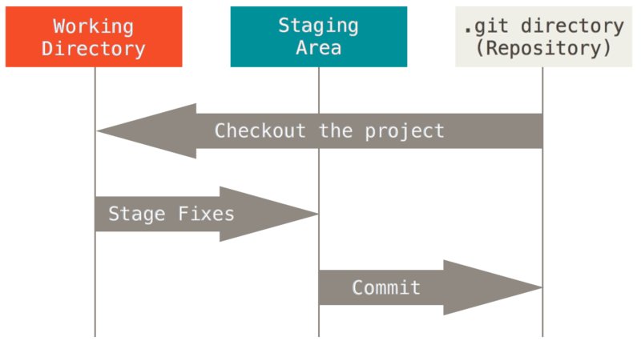

# 内容概要
1. Git保存数据的方式(Git对象)
1. Git中三颗树含义及其操纵方式
1. Git中分支的创建、删除与合并
# 参考文献
1. Git Pro
1. [git cat-file error](https://stackoverflow.com/questions/8149887/git-cat-file-p-sha1-fatal-not-a-valid-object-name-on-random-objects-fro)
# 1. Git保存数据的方式
我们稍微回顾一下基本的Git工作流程:

1. 在工作目录中修改文件。
1. 暂存文件(git add)，将文件的快照放入暂存区域。
1. 提交更新(git commit)，找到暂存区域的文件，将快照永久存储到Git版本库。

当使用*git add*进行暂存操作时，Git会为每一个文件计算校验和（SHA-1哈希算法），然后把当前版本的文件快照保存到**blob对象**中并放置于Git版本库。（校验和为40位16进制数,前两位用作目录名，剩余的38位用作blob对象的文件名）。当使用*git commit*进行提交操作时，Git会先计算每一个子目录的校验和，然后在Git版本库中创建一个**树对象**，记录目录结构和blob对象索引，随后创建一个**提交对象**，包含指向前述对象的指针和所有提交信息。

blob对象、树对象、提交对象统称为**Git对象**，所有的Git对象都保存在.git/objects/ 文件夹下。
## 1.1 blob对象（blob object）
我们先使用*git add*命令创建blob对象
```sh
$ git init git-object-study
$ cd init git-object-study
$ vim hello.h
$ vim main.cpp
$ mkdir doc
$ vim doc/README.md
$ git add .
```
看一下.git/objects/ 文件夹下有哪些文件
```sh
$ find .git/objects -type f
.git/objects/2b/f944bf1fd5bf37bddb0a78c3a486f00260979a # main.cpp
.git/objects/d1/e804d25075a20c19e9f0ae4cf6c86b9a976c3a # hello.h
.git/objects/3a/3a9fd64de1d335ecedfcc2197d3eff85d35d55 # README.md
```
我们可以用*git cat-file*命令从Git那里取回数据。指定*-p* 选项可指示该命令自动判断内容的类型，并为我们显示格式友好的内容。指定*-t* 选项可以让Git告诉我们存储对象的类型
```
$ git cat-file -t  2bf944bf1fd5bf37bddb0a78c3a486f00260979a
blob
$ git cat-file -p  2bf944bf1fd5bf37bddb0a78c3a486f00260979a
#include"hello.h"

int main(){
    Greeting();
}
$ git cat-file -t  d1e804d25075a20c19e9f0ae4cf6c86b9a976c3a
blob
$ git cat-file -p  d1e804d25075a20c19e9f0ae4cf6c86b9a976c3a
#include<cstdio>

void Greeting(){
    std::printf("Hello World\n");
}
$ git cat-file -t  3a3a9fd64de1d335ecedfcc2197d3eff85d35d55
blob
$ git cat-file -p  3a3a9fd64de1d335ecedfcc2197d3eff85d35d55
Git Object Study
```
到这里我们可以看出，Git可以看成是一个简单的键值对数据库，你可以像数据库插入任意内容（Git对象），它会返回一个键值（SHA-1哈希值），通过该键值可以在任意时刻再次检索该内容。
## 1.2 树对象（tree object）
然而，记住文件的每一个版本对应的SHA-1值并不现实；另一个问题是，目前文件名并没有被保存，我们仅仅保存了文件内容。我们接下来要探讨树对象，它能解决文件名保存的问题，也允许我们将多个文件组织到一起。

我们用*git commit*创建树对象和随后要探讨的提交对象
```sh
$ git commit -m 'version 1'
```
看一下现在有哪些Git对象
```sh
$ find .git/objects -type f
.git/objects/2b/f944bf1fd5bf37bddb0a78c3a486f00260979a
.git/objects/d1/e804d25075a20c19e9f0ae4cf6c86b9a976c3a
.git/objects/3a/3a9fd64de1d335ecedfcc2197d3eff85d35d55
.git/objects/d9/844a9f371e199dea906d384480e341a860d706
.git/objects/f0/c809f7840fb2e95306623bcc014814679f8602
.git/objects/bc/2639af17952ea4671b7e858312b5d96daa1a16
```
对比之前，可以看出多了三个Git对象，我们找出其中的树对象
```sh
$ git cat-file -t d9844a9f371e199dea906d384480e341a860d706
tree
$ git cat-file -t f0c809f7840fb2e95306623bcc014814679f8602
tree
$ git cat-file -t bc2639af17952ea4671b7e858312b5d96daa1a16
commit
```
看一下树对象的结构
```sh
$ git cat-file -p d9844a9f371e199dea906d384480e341a860d706
040000 tree f0c809f7840fb2e95306623bcc014814679f8602	doc
100644 blob d1e804d25075a20c19e9f0ae4cf6c86b9a976c3a	hello.h
100644 blob 2bf944bf1fd5bf37bddb0a78c3a486f00260979a	main.cpp
$ git cat-file -p f0c809f7840fb2e95306623bcc014814679f8602
100644 blob 3a3a9fd64de1d335ecedfcc2197d3eff85d35d55	README.md
```
输出的每一条记录包含了相应的文件模式、类型、文件名信息。这里的文件模式参考了常见的UNIX文件模式，*100644*表征普通文件，*040000*表征目录。从概念上讲，Git内部像这样存储树对象：


我们还可以有更方便的方式查看项目所对应的最新顶层树对象
```sh
$ git cat-file -p master^{tree}
040000 tree f0c809f7840fb2e95306623bcc014814679f8602	doc
100644 blob d1e804d25075a20c19e9f0ae4cf6c86b9a976c3a	hello.h
100644 blob 2bf944bf1fd5bf37bddb0a78c3a486f00260979a	main.cpp
```
master^{tree} 语法表示 master 分支上最新的提交所指向的树对象。如果是在fish而不是bash中调用以上命令，需要对花括号进行转义
```sh
git cat-file -p master^\{tree\}
```
## 1.3 提交对象（commit object）
现在我们有了树对象了，解决了文件名和文件组织结构问题，但我们仍不知道是谁保存了这些快照，在什么时候保存的，而这正是提交对象能为我们保存的基本信息。

看一下提交对象的内容
```sh
$ git cat-file -p bc2639af17952ea4671b7e858312b5d96daa1a16
tree d9844a9f371e199dea906d384480e341a860d706
author LYC-BF <540536130@qq.com> 1553049544 +0800
committer LYC-BF <540536130@qq.com> 1553049544 +0800

version 1
```
提交对象的格式很简单：它先指定一个顶层树对象，代表当前项目快照；然后是提交者信息(依据你的user.name 和 user.email 配置来设定,外加一个时间戳);留空一行,最后是提交注释。

类似地，我们也有更简便的方式查看最新的提交对象。
```sh
$ git cat-file -p master^{commit}
```

我们修改一下*hello.h*,进行一次新的提交,再查看提交对象
```sh
$ vim hello.h
$ git commit -a -m 'version 2' 
```
查看一下提交对象和其包含的顶层树对象
```sh
$ git cat-file -p master^{commit}
tree fd9d6c5609ead8f359956594cdc3018b1eaad3bb
parent bc2639af17952ea4671b7e858312b5d96daa1a16
author LYC-BF <540536130@qq.com> 1553065891 +0800
committer LYC-BF <540536130@qq.com> 1553065891 +0800

version 2
$ git cat-file -p fd9d6c5609ead8f359956594cdc3018b1eaad3bb
040000 tree f0c809f7840fb2e95306623bcc014814679f8602	doc
100644 blob e60fa0446c145d0368257ede6c53e622e7fab358	hello.h
100644 blob 2bf944bf1fd5bf37bddb0a78c3a486f00260979a	main.cpp
```
相比于首次提交产生的提交对象，新的提交对象有一个父对象指针，指向上一次的提交对象。（后面我们可以看到，由多个分支合并产生的提交对象有多个父对象）
跟踪所有的指针，我们可以得到下面的对象关系图


# 2. Git中的三棵树
在理解了Git对象以后，我们重新审视一下Git的三个工作区

Git作为内容管理系统，是以三棵树分别管理三个工作区的
树 | 用途 | 负责的工作区
---- | ---- | ----
HEAD | 指向上一次*git commit*创建的提交对象 | Git版本库
Index | 指向下一次*git commit*将创建的树对象 | 暂存区
Working Directory | 沙盒 | 工作目录
## 2.1 HEAD
HEAD总是指向当前分支的最后一个提交对象，这表明HEAD将指向下一次提交的父对象。我们可以在*cat-file*命令中用HEAD代替master^{commit}。
```sh
$ git cat-file -p HEAD
tree fd9d6c5609ead8f359956594cdc3018b1eaad3bb
parent bc2639af17952ea4671b7e858312b5d96daa1a16
author LYC-BF <540536130@qq.com> 1553065891 +0800
committer LYC-BF <540536130@qq.com> 1553065891 +0800
```
遇到树对象就递归展开
```sh
version 2
$ git ls-tree -r HEAD
100644 blob 3a3a9fd64de1d335ecedfcc2197d3eff85d35d55	doc/README.md
100644 blob e60fa0446c145d0368257ede6c53e622e7fab358	hello.h
100644 blob 2bf944bf1fd5bf37bddb0a78c3a486f00260979a	main.cpp
```
## 2.2 Index
Index指向下一次*git commit*将创建的树对象,可以调用*ls-files*命令列出该树对象的叶子结点
```sh
$ git ls-files -s
100644 3a3a9fd64de1d335ecedfcc2197d3eff85d35d55 0	doc/README.md
100644 e60fa0446c145d0368257ede6c53e622e7fab358 0	hello.h
100644 2bf944bf1fd5bf37bddb0a78c3a486f00260979a 0	main.cpp
```
## 2.3 Working Directory
前两棵树已一种高效但并不直观的方式，将内容存储在.git文件夹中。Working Directory是一个沙盒，在修改提交到暂存区前，可以任意更改。使用*tree*命令查看Working Directory的结构
```sh
$ tree
.
├── doc
│   └── README.md
├── hello.h
└── main.cpp

1 directory, 3 files
```
## 2.4 三棵树的操纵
假设最初工作目录中只有一个file.txt文件，此时还没有进行任何暂存和提交操作。
```sh
$ git init
$ vim file.txt
```

调用*git add*暂存
```sh
$ git add .
```

调用*git commit*提交
```sh
$ git commit -m 'first commit'
```

修改file.txt文件
```sh
$ vim file.txt
```

再次调用*git add*暂存
```sh
$ git add .
```

再次调用*git commit*提交
```sh
$ git commit -m 'second commit'
```

修改file.txt文件后再次提交
```sh
$ vim file.txt 
$ git commit -a -m 'third commit'
```

*git status*本质上就是比较三棵树的内容，当三棵树里的内容相同时，我们调用*git status*就会发现
```sh
$ git status
On branch master
nothing to commit, working tree clean
```
情况1：调用*git reset --soft*移动HEAD指向的分支(HEAD~表示HEAD的父结点)
```sh
$ git reset --soft 9e5e64ash
```

情况2：调用*git reset \[--mixed\]*移动HEAD指向的分支
```sh
$ git reset --mixed 9e5e64ash
```

情况3：调用*git reset --hard*移动HEAD指向的分支
```sh
$ git reset --hard 9e5e64ash
```

情况4：调用*git reset*只拉取一个文件的特定版本
```sh
$ git reset eb43 -- file.txt
```

情况5：调用*git checkout*只拉取一个文件的特定版本
```sh
$ git checkout eb43 -- file.txt
```

## 2.5 小trick之压缩提交
假设你有一个项目,第一次提交中有一个文件,第二次提交增加了一个新的文件并修改了第一个文件,第三次提交再次修改了第一个文件。由于第二次提交是一个未完成的工作,因此你想要压缩它。

调用*git reset*将HEAD指向其祖父提交对象上(即你想要保留的第
一个提交)
```sh
$ git reset --soft HEAD~2
```

再次提交
```sh
$ git commit -m 'second commit'
```

如果现在你查看提交历史，会有个 v1 版 file-a.txt 的提交,接着第二个提交将 file-a.txt 修改成了 v3 版并增加file-b.txt。包含 v2 版本的文件已经不在历史中了。

# 3. Git分支
Git的分支，本质上是指向提交对象的可变指针，其仅包含所指对象的校验和（如前所述，为一长度为40的SHA-1字符串），因此其创建异常高效。调用*git init*会创建默认分支master，"master"分支跟其他分支没有任何其他区别。在每次的提交操作中，分支自动向新的提交对象移动。
## 3.1 分支创建与查看
首先我们先查看当前所有分支的提交历史
```sh
$ git log --oneline --decorate --graph --all
* 45c7b71 (HEAD -> master) version 2
* bc2639a version 1
```
目前只有一个master分支，有两次提交，我们来创建一个新的testing分支
```sh
$ git branch testing
```
再查看一下所有分支的提交历史
```sh
$ git log --oneline --decorate --graph --all
* 45c7b71 (HEAD -> master, testing) version 2
* bc2639a version 1
```
可以看到，当前有两个分支master和testing，前面我们提到HEAD指针指向当前分支的最新的提交对象，在这个意义上，它是当前分支的别名。但是HEAD是个特殊的指针，它又指向了当前所在的本地分支（在这里是master），来帮助我们知道当前在哪一个分支上，具体是怎么实现的我们不去讨论。可以看到*git branch*命令仅仅创建了一个新分支，并没有进行分支切换。
## 3.1 分支切换
我们使用*git checkout*命令切换到指定分支
```sh
$ git checkout testing
Switched to branch 'testing'
$ git log --oneline --decorate --graph --all
* 45c7b71 (HEAD -> testing, master) version 2
* bc2639a version 1
```
我们切换到testing分支了，HEAD也指向了testing。我们做一次新的提交
```sh
$ vim main.cpp
$ git commit -a -m 'version 3'
$ git log --oneline --decorate --graph --all
* 033aaf0 (HEAD -> testing) version 3
* 45c7b71 (master) version 2
* bc2639a version 1
```
可以看出，在提交时，只有当前所在分支(testing)和HEAD指针会向前运动，指向新的提交对象，而其他分支保持不动。我们将分支切回master，再修改提交一次。
```sh
$ git checkout master
$ vim hello.h
$ git commit -a -m 'version 4'
$ git log --oneline --decorate --graph --all 
* 21545c4 (HEAD -> master) version 4
| * 033aaf0 (testing) version 3
|/  
* 45c7b71 version 2
* bc2639a version 1
```
现在这个项目的提交历史产生了分叉。
## 3.2 分支合并
所谓分支合并，就是将两个分支相对于同一个提交对象的不同修改合并，并将结果更新其中一个分支。我们首先要调用*git checkout < branch to be updated>*命令切换到待更新的分支，再调用*git merge < branch to be merged >*去合并另一个分支的修改。
### 3.2.1 快进合并
假设我们要将当前分支作为feature分支，而将master分支回滚到第一个提交对象
```sh
$ git branch feature
$ git reset --soft bc2639a
$ git log --oneline --decorate --graph --all
* 21545c4 (feature) version 4
| * 033aaf0 (testing) version 3
|/  
* 45c7b71 version 2
* bc2639a (HEAD -> master) version 1
```
觉得feature分支挺好用的，想让master分支合并feature的提交
```sh
$ git merge feature
Updating bc2639a..21545c4
Fast-forward
 hello.h | 3 +--
 1 file changed, 1 insertion(+), 2 deletions(-)
$ git log --oneline --decorate --graph --all
* 21545c4 (HEAD -> master, feature) version 4
| * 033aaf0 (testing) version 3
|/  
* 45c7b71 version 2
* bc2639a version 1
```
由于我们可以从master分支沿着箭头可以直接走到feature分支，也就是说feature分支的文件是在master分支的基础上一步一步修改的，因此合并操作没有分歧，合并时只会将分支向前推进，这叫“快进”。
### 3.2.2 简单的三方合并
可以看到，master分支和testing分支的最近的共同祖先是提交对象45c7b71，我们先看一下master分支相对45c7b71做了哪些修改
```sh
$ git log --stat -1
commit 21545c41106449575ba0d7bc572f1b1ee933489e (HEAD -> master, feature)
Author: LYC-BF <540536130@qq.com>
Date:   Thu Mar 21 09:31:28 2019 +0800

    version 4

 hello.h | 1 -
 1 file changed, 1 deletion(-)
```
再看一下testing分支相对45c7b71做了哪些修改
```sh
$ git checkout testing
$ git log --stat -1
Author: LYC-BF <540536130@qq.com>
Date:   Wed Mar 20 22:09:35 2019 +0800

    version 3

 main.cpp | 1 +
 1 file changed, 1 insertion(+)
```
master分支修改了hello.h，testing分支修改了main.cpp，两个分支相对于共同祖先45c7b71分别修改了不同文件，因此这两个分支的合并是一个简单的三方合并
```sh
$ git checkout master
$ git merge testing
Merge made by the 'recursive' strategy.
 main.cpp | 1 +
 1 file changed, 1 insertion(+)
$ git log --oneline --decorate --graph --all
*   065b7df (HEAD -> master) Merge branch 'testing'
|\  
| * 033aaf0 (testing) version 3
* | 21545c4 (feature) version 4
|/  
* 45c7b71 version 2
* bc2639a version 1
```
与之前的快进合并不同的是，这次的合并创建了一个新的提交对象，并且这个提交对象有两个父对象，分别为合并前的两个分支的提交对象。
### 3.2.3 有冲突的三方合并
突然后悔了，想把master直接指向testing分支指向的提交对象。
```sh
$ git reset --soft testing
$ git log --oneline --decorate --graph --all
* 21545c4 (feature) version 4
| * 033aaf0 (HEAD -> master, testing) version 3
|/  
* 45c7b71 version 2
* bc2639a version 1
```
这个时候master和testing指向同一个提交对象，因此我们可以把testing分支删掉
```sh
$ git branch -d testing
Deleted branch testing (was 033aaf0).
$ git log --oneline --decorate --graph --all
* 21545c4 (feature) version 4
| * 033aaf0 (HEAD -> master) version 3
|/  
* 45c7b71 version 2
* bc2639a version 1
```
在master分支，我也想修改一下hello.h
```sh
$ vim hello.h
$ git commit -a -m 'version 5'
$ git log --oneline --decorate --graph --all
* 6075e47 (HEAD -> master) version 5
* 033aaf0 version 3
| * 21545c4 (feature) version 4
|/  
* 45c7b71 version 2
* bc2639a version 1
```
想合并一下feature分支的修改
```sh
$ git merge feature 
Auto-merging hello.h
CONFLICT (content): Merge conflict in hello.h
Automatic merge failed; fix conflicts and then commit the result.
```
合并失败了，我们用*git status*来查看一下哪些文件由于冲突而处于为未合并状态
```sh
$ git status
On branch master
You have unmerged paths.
  (fix conflicts and run "git commit")
  (use "git merge --abort" to abort the merge)

Unmerged paths:
  (use "git add <file>..." to mark resolution)

	both modified:   hello.h

no changes added to commit (use "git add" and/or "git commit -a")
```
可以看到两个分支都修改了hello.h文件（在下面我们会看到修改的还是同一处），修改同一个文件的同一处就会导致自动合并失败，Git会在冲突的文件中加入一些特殊区段
```
$ cat hello.h
#include<cstdio>
<<<<<<< HEAD
//Function to greet
=======
>>>>>>> feature
void Greeting(){
    std::printf("Hello China\n");
    return;
}
```
HEAD所指示的版本在这个区段的上半部分(======= 的上半部分)，feature所指示的版本在 ======= 的下半部分。为了解决冲突,你必须选择使用由 ======= 分割的两部分中的一个,或者你也可以自行合并这些内容。例如,你可以通过把这段内容换成下面的样子来解决冲突：
```
#include<cstdio>
//A test function
void Greeting(){
    std::printf("Hello China\n");
    return;
}
```
使用*git add*标记已解决冲突的文件
```sh
$ git add hello.h
$ git status
On branch master
All conflicts fixed but you are still merging.
  (use "git commit" to conclude merge)

Changes to be committed:

	modified:   hello.h
```
使用*git commit*完成合并
```sh
$ git commit
[master 10f5477] Merge branch 'feature'
$ git log --oneline --decorate --graph --all
*   10f5477 (HEAD -> master) Merge branch 'feature'
|\  
| * 21545c4 (feature) version 4
* | 6075e47 version 5
* | 033aaf0 version 3
|/  
* 45c7b71 version 2
* bc2639a version 1
```