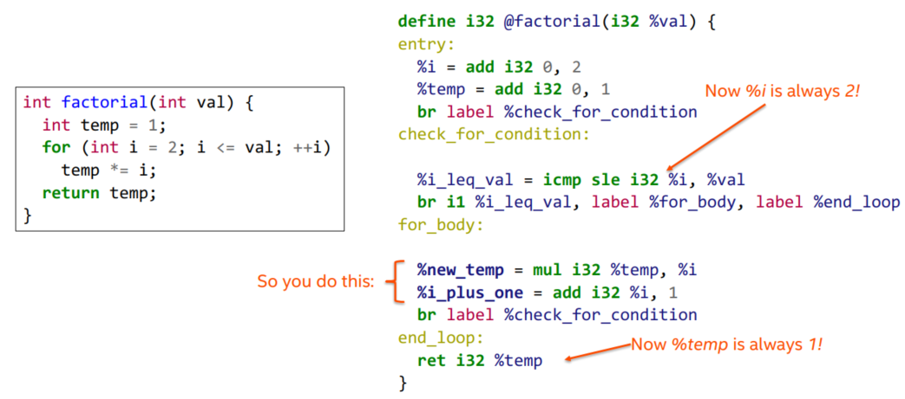
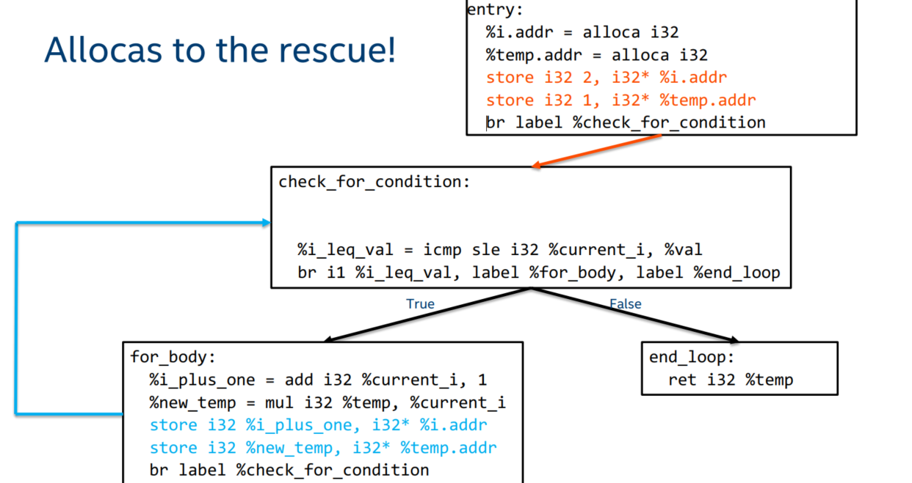

# 内容概要
1. 什么是LLVM IR?如何得到IR?
1. LLVM编译的流程，IR文件之间的链接简介
1. C++ name mangling的用途，“extern C"作用的极简介绍
1. IR文件的布局
1. IR中函数定义的结构，什么是BB，什么是CFG
1. IR是一个强类型语言，如何用工具检查IR的合法性
1. 如何理解[Language reference](https://llvm.org/docs/LangRef.html)
1. 常见的terminator instruction介绍
1. 如何利用工具得到函数的CFG
1. 什么是SSA？SSA的好处和问题，以及如何解决这个问题

# 参考文献
1. [what is tail reursion](https://stackoverflow.com/questions/33923/what-is-tail-recursion)
1. [make clang compile to ll](https://stackoverflow.com/questions/9148890/how-to-make-clang-compile-to-llvm-ir)
1. [-cc1的含义](https://stackoverflow.com/questions/8991662/what-does-the-clang-cc1-option-do)
1. [clang和clang++的区别](https://stackoverflow.com/questions/20047218/what-is-the-difference-clang-clang-std-c11)
1. [what is a linkage unit?](https://en.wikipedia.org/wiki/Translation_unit_(programming))
1. [LLVM LanguageRef](https://llvm.org/docs/LangRef.html)
1. [extern "C"的作用](https://stackoverflow.com/questions/1041866/what-is-the-effect-of-extern-c-in-c)
1. [what is name mangling](https://www.ibm.com/support/knowledgecenter/en/ssw_ibm_i_72/rzarg/name_mangling.htm)
1. [what is static single assignment?](https://en.wikipedia.org/wiki/Static_single_assignment_form)
1. [what is reaching definition?](https://en.wikipedia.org/wiki/Reaching_definition)

# 1. 什么是LLVM IR？
**LLVM IR** 是 **LLVM Intermediate Representation**，它是一种
* low-level languange，是一个像**RISC**的指令集。
* 然而可以很表达high-level的ideas，就是说high-level languange可以很干净地map到LLVM IR
* 这使得我们可以高效地进行代码优化

# 2. 如何得到IR？
我们先以尾递归的形式实现一个阶乘，再在`main`函数中调用中这个阶乘
```C
// factorial.c
int factorial(int val, int total) {
  if(val==1) return total;
  return factorial(val-1, val * total);
}
```
` `
```Cpp
// main.cpp
extern "C" int factorial(int);
int main(int argc, char** argv) {
    return factorial(2, 1) * 7 == 42;
}
```
>注：这里的`extern "C"`是必要的，为了支持C++的函数重载和作用域的可见性的规则，编译器会对函数进行name mangling, 如果不加`extern "C"`，下文中生成的`main.ll`文件中`factorial`的函数名会被mangling成类似`_Z9factoriali`的样子，链接器便找不到要链接的函数。

LLVM IR有两种等价的格式，一种是`.bc`(Bitcode)文件，另一种是`.ll`文件，`.ll`文件是Human-readable的格式。
我们可以使用下面的命令得到这两种格式的IR文件
```sh
$ clang -S -emit-llvm factorial.c # factorial.ll
$ clang -c -emit-llvm factorial.c # factorial.bc
```
我们可以利用`grep`命令查看`clang`参数的含义
```sh
$ clang --help | grep -w -- -[Sc]factorial.ll
-c  Only run preprocess, compile, and assemble steps
-S  Only run preprocess and compilation steps
```
既然两种格式等价，自然就可以相互转换
```sh
$ llvm-as factorial.ll # factorial.bc
$ llvm-dis factorial.bc # factorial.ll
```
对于cpp文件，只需将`clang`命令换成`clang++`即可。
```sh
$ clang++ -S -emit-llvm main.cpp # main.ll
$ clang++ -c -emit-llvm main.cpp # main.bc
```
# 3. IR文件之间的链接以及将IR转为Target machine code


上图显示了llvm编译代码的一个pipleline, 其利用不同高级语言对应的前端（这里C/C++的前端都是clang）将其transform成LLVM IR，进行优化，链接后，再传给不同target的后端transform成target-specific的二进制代码。IR是LLVM的power所在，我们看下面这条command:
```sh
$ llvm-link factorial.bc main.bc -o linked.bc # lined.bc
```
`llvm-link`将两个IR文件链接起来了，值得注意的是`factorial.bc`是C转成的IR，而
`main.bc`是C++转成的IR，也就是说到了IR这个level，高级语言之间的差异消失了！它们之间可以相互链接（这里只是演示了C和C++的，其他语言的也可以链接）。

我们进一步可以将链接得到的IR转成target相关的code
```sh
llc --march=x86-64 linked.bc # linked.s
```
下图展示了完整的build过程


# 4. IR文件的布局


## 4.1 Target information
我们以`linked.ll`为例进行解析，文件的开头是
```llvm
; ModuleID = 'linked.bc'
source_filename = "llvm-link"
target datalayout = "e-m:e-i64:64-f80:128-n8:16:32:64-S128"
target triple = "x86_64-unknown-linux-gnu"
```
`;`后面的注释指明了module的标识，`source_filename`是表明这个module是从什么文件编译得到的（如果你打开`main.ll`会发现这里的值是`main.cpp`），如果该modules是通过链接得到的，这里的值就会是`llvm-link`。

Target information的主要结构如下：


## 4.2 函数定义的主要结构
我们看一下函数`factorial`的定义
```llvm
; Function Attrs: noinline nounwind optnone uwtable
define dso_local i32 @factorial(i32 %val, i32 %total) #0 {
entry:
  %retval = alloca i32, align 4
  %val.addr = alloca i32, align 4
  %total.addr = alloca i32, align 4
  store i32 %val, i32* %val.addr, align 4
  store i32 %total, i32* %total.addr, align 4
  %0 = load i32, i32* %val.addr, align 4
  %cmp = icmp eq i32 %0, 1
  br i1 %cmp, label %if.then, label %if.end

if.then:                                          ; preds = %entry
  %1 = load i32, i32* %total.addr, align 4
  store i32 %1, i32* %retval, align 4
  br label %return

if.end:                                           ; preds = %entry
  %2 = load i32, i32* %val.addr, align 4
  %sub = sub nsw i32 %2, 1
  %3 = load i32, i32* %val.addr, align 4
  %4 = load i32, i32* %total.addr, align 4
  %mul = mul nsw i32 %3, %4
  %call = call i32 @factorial(i32 %sub, i32 %mul)
  store i32 %call, i32* %retval, align 4
  br label %return

return:                                           ; preds = %if.end, %if.then
  %5 = load i32, i32* %retval, align 4
  ret i32 %5
}
```
前面已经提到，`;`表示单行注释的开始。`define dso_local i32 @factorial(i32 %val) #0`表明开始定义一个函数，其中第一个`i32`是返回值类型，对应C语言中的`int`；`%factorial`是函数名；第二个`i32`是形参类型，`%val`是形参名。llvm中的标识符分为两种类型：全局的和局部的。全局的标识符包括函数名和全局变量，会加一个`@`前缀，局部的标识符会加一个`%`前缀。一般地，可用标识符对应的正则表达式为`[%@][-a-zA-Z$._][-a-zA-Z$._0-9]*`。

`dso_local`是一个Runtime Preemption说明符，表明该函数会在同一个链接单元（即该函数所在的文件以及包含的头文件）内解析符号。`#0`指出了该函数的attribute group。在文件的下面，你会找到类似这样的代码
```llvm
attributes #0 = { noinline nounwind optnone uwtable "correctly-rounded-divide-sqrt-fp-math"="false" "disable-tail-calls"="false" "less-precise-fpmad"="false" "min-legal-vector-width"="0" "no-frame-pointer-elim"="true" "no-frame-pointer-elim-non-leaf" "no-infs-fp-math"="false" "no-jump-tables"="false" "no-nans-fp-math"="false" "no-signed-zeros-fp-math"="false" "no-trapping-math"="false" "stack-protector-buffer-size"="8" "target-cpu"="x86-64" "target-features"="+cx8,+fxsr,+mmx,+sse,+sse2,+x87" "unsafe-fp-math"="false" "use-soft-float"="false" }
```
因为attribute group可能很包含很多attribute且复用到多个函数，所以我们IR使用attribute group ID(即`#0`)的形式指明函数的attribute，这样既简洁又清晰。

在一对花括号里的就是函数体，函数体是由一系列basic blocks(BB)组成的，这些BB形成了函数的控制流图(Control Flow Graph, CFG)。每个BB都有一个label，label使得该BB有一个符号表的入口点，在函数`factorial`中，这些BB的label就是`entry`、`if.then`、`if.end`，BB总是以terminator instruction(e.g. `ret`、`br`、`callbr`)结尾的。

# 5. IR是一个强类型语言
看一下函数`main`的定义
```llvm
; Function Attrs: noinline norecurse optnone uwtable
define dso_local i32 @main(i32 %argc, i8** %argv) #1 {
entry:
  %retval = alloca i32, align 4
  %argc.addr = alloca i32, align 4
  %argv.addr = alloca i8**, align 8
  store i32 0, i32* %retval, align 4
  store i32 %argc, i32* %argc.addr, align 4
  store i8** %argv, i8*** %argv.addr, align 8
  %call = call i32 @factorial(i32 2, i32 1)
  %mul = mul nsw i32 %call, 7
  %cmp = icmp eq i32 %mul, 42
  %conv = zext i1 %cmp to i32
  ret i32 %conv
}
```
LLVM的IR是一个强类型语言，每一条指令都显式地指出了实参的类型，例如`mul nsw i32 %call, 7`表明要将两个`i32`的数值相乘，`icmp eq i32 %mul, 42`表明要将两个i32的数据类型进行相等比较（这里`%mul`是一个变量，而`mul`是一条指令，可以看出IR加前缀的好处）。此外，我们还很容易推断出返回值的类型，比如`i32`的数相乘的返回值就是`i32`类型，比较两个数值的相等关系的返回值就是`i1`类型。

强类型不但使得IR很human readable，也使得在优化IR时不需要考虑隐式类型转换的影响。在`main`函数的结尾，`zext i1 %cmp to i32`将`%cmp`从1位整数扩展成了32位的整数（即做了一个类型提升）。如果我们把最后两行用以下代码替代
```llvm
ret i32 %cmp
```
那么这段IR就变成illegal的，检查IR是否合法可以使用`opt -verify <filename>`命令
```sh
$ opt -verify linked.ll
opt: linked.ll:45:11: error: '%cmp' defined with type 'i1' but expected 'i32'
  ret i32 %cmp
```

# 6. LangRef is your friend
在函数`main`的定义中，我们可以看到这样一条IR
```llvm
%call = call i32 @factorial(i32 2)
```
对照着相应的C++代码我们很容易可以猜出每个符号的含义，但是每条指令可以有很多的变体，当我们不确定符号的含义的时候，[LangRef](https://llvm.org/docs/LangRef.html)为我们提供了参考
```llvm
<result> = [tail | musttail | notail ] call [fast-math flags] [cconv] [ret attrs] [addrspace(<num>)]
           <ty>|<fnty> <fnptrval>(<function args>) [fn attrs] [ operand bundles ]
```
`[]`包围的表示可选参数（可以不写），`<>`包围的表示必选参数，选项用`|`分格开，表示只能写其中一个。


# 6. 常见的terminator instruction介绍
## 6.1 `ret`
### 语法
```llvm
ret <type> <value>       ; Return a value from a non-void function
ret void                 ; Return from void function
```
### 概述
`ret`用来将控制流从callee返回给caller
### Example
```llvm
ret i32 5                       ; Return an integer value of 5
ret void                        ; Return from a void function
ret { i32, i8 } { i32 4, i8 2 } ; Return a struct of values 4 and 2
```
## 6.2 `br`
### 语法
```llvm
br i1 <cond>, label <iftrue>, label <iffalse>
br label <dest>          ; Unconditional branch
```
### 概述
`br`用来将控制流转交给**当前**函数中的另一个BB。
### Example
```llvm
Test:
  %cond = icmp eq i32 %a, %b
  br i1 %cond, label %IfEqual, label %IfUnequal
IfEqual:
  ret i32 1
IfUnequal:
  ret i32 0
```
### 6.3 `switch`
### 语法
```llvm
switch <intty> <value>, label <defaultdest> [ <intty> <val>, label <dest> ... ]
```
### 概述
`switch`根据一个整型变量的值，将控制流交给不同的BB。
### Example
```llvm
; Emulate a conditional br instruction
%Val = zext i1 %value to i32
switch i32 %Val, label %truedest [ i32 0, label %falsedest ]

; Emulate an unconditional br instruction
switch i32 0, label %dest [ ]

; Implement a jump table:
switch i32 %val, label %otherwise [ i32 0, label %onzero
                                    i32 1, label %onone
                                    i32 2, label %ontwo ]
```
## 6.4 `unreachable`
### 语法
```llvm
unreachable
```
### 概述
`unreachable`告诉optimizer控制流时到不了这块代码，就是说这块代码是dead code。
### Example
在展示`unreachable`的用法的之前，我们先看一下`undef`的用法。`undef`表示一个未定义的值，只要是常量可以出现的位置，都可以使用`undef`。（此Example标题下的代码为伪代码）
```llvm
%A = or %X, undef
%B = and %X, undef
```
`or`指令和`and`指令分别是执行按位或和按位与的操作，由于`undef`的值是未定义的，因此编译器可以随意假设它的值来对代码进行优化，譬如说假设undef的值都是0
```llvm
%A = %X
%B = 0
```
可以假设undef的值是-1
```llvm
%A = -1
%B = %X
```
也可以假设undef的两处值是不同的，譬如第一处是0，第二处是-1
```llvm
%A = -1
%B = 0
```
为什么`undef`的值可以不同呢？这是因为`undef`对应的值是没有确定的生存期的，当我们需要一个undef的值的时候，编译器会从可用的寄存器中随意取一个值拿过来，因此并不能保证其值随时间变化具有一致性。下面我们可以看`unreachable`的例子了
```llvm
%A = sdiv undef, %X
%B = sdiv %X, undef
```
`sdiv`指令是用来进行整数/向量的除法运算的，编译器可以假设`undef`的值是0，因为一个数除以0是未定义行为，因此编译器可以认为其是dead code，将其优化成
```llvm
%A = 0
unreachable
```
# 6. 控制流图（Control Flow Graph）
既然函数体是由一系列basic blocks(BB)组成的，并且BB形成了函数的控制流图,每个BB都有唯一的label,那么我们就可以label之间的跳转关系来表示整个函数的控制流图，llvm提供了`opt -analyze -dot-cfg-only <filename>`命令来帮助我们生成
```sh
$ opt -analyze -dot-cfg-only factorial.ll
$ vim .factorial.dot
```
```llvm
digraph "CFG for 'factorial' function" {
        label="CFG for 'factorial' function";

        Node0x207ced0 [shape=record,label="{entry|{<s0>T|<s1>F}}"];
        Node0x207ced0:s0 -> Node0x207d7e0;
        Node0x207ced0:s1 -> Node0x207d8b0;
        Node0x207d7e0 [shape=record,label="{if.then}"];
        Node0x207d7e0 -> Node0x207da90;
        Node0x207d8b0 [shape=record,label="{if.end}"];
        Node0x207d8b0 -> Node0x207da90;
        Node0x207da90 [shape=record,label="{return}"];
}
```
把它画成图就非常清晰了


# 7. IR是静态单一赋值的（Static Single Assignment）
在IR中，每个变量都在使用前都必须先定义，且每个变量只能被赋值一次（如果套用C++的术语，就是说每个变量只能被初始化，不能被赋值），所以我们称IR是静态单一赋值的。举个例子的，假如你想返回`a*b+c`的值，你觉得可能可以这么写
```llvm
%0 = mul i32 %a, %b
%0 = add i32 %0, %c
ret i32 %0
```
但是这里%0被赋值了两次，是不合法的，我们需要把它修改成这样
```llvm
%0 = mul i32 %a, %b
%1 = add i32 %0, %c
ret i32 %1
```
## 7.1 SSA的好处
SSA可以简化编译器的优化过程，譬如说，考虑这段代码
```
d1: y := 1
d2: y := 2
d3: x := y
```
我们很容易可以看出第一次对`y`赋值是不必要的，在对`x`赋值时使用的`y`的值时第二次赋值的结果，但是编译器必须要经过一个定义可达性(Reaching definition)分析才能做出判断。编译器是怎么分析呢？首先我们先介绍几个概念：
* **变量x的定义**是指一个会给x赋值或可能给x赋值的语句，譬如`d1`就是对`y`的一个定义
* 当一个变量x有新的定义后 ，旧的的定义会被新的定义**kill**掉，譬如`d2`就kill掉了`d1`。
* **一个定义d到达点p**是指存在一条d到p路径，在这条路径上，d没有被kill掉
* **t1是t2的reaching definition**是指存在一条t1到t2路径，沿着这条路径走就可以得到t1要赋值的变量的值，而不需要额外的信息。

按照上面的代码写法，编译器是很难判断`d3`的reaching definition的。因为`d3`的reaching definition可能是`d1`，也可能是`d2`，要搞清楚`d1`和`d2`谁kill了谁很麻烦。但是，如果我们的代码是SSA的，则代码就会长成这样
```
d1: y1 := 1
d2: y2 := 2
d3: x := y2
```
编译发现`x`是由`y2`赋值得到，而`y2`被赋值了2，且`x`和`y2`都只能被赋值一次，显然得到`x`的值的路径就是唯一确定的，`d2`就是`d3`的reaching definition。
## 7.3 SSA带来的问题
假设你想用IR写一个用循环实现的factorial函数
```C
int factorial(int val) {
  int temp = 1;
  for (int i = 2; i <= val; ++i)
  temp *= i;
  return temp;
}
```
按照C语言的思路，我们可能大概想这样写


然而跑`opt -verify <filename>`命令我们就会发现`%temp`和`%i`被多次赋值了，这不合法。但是如果我们把第二处的`%temp`和`%i`换掉，改成这样



那返回值就会永远是1。

## 7.4 `phi`指令来救场
### 语法
```LLVM
<result> = phi <ty> [<val0>, <label0>], [<val1>, <label1>] …
```
### 概述
根据前一个执行的是哪一个BB来选择一个变量的值。

有了`phi`指令，我们就可以把代码改成这样


这样的话，每个变量就只被赋值一次，并且实现了循环递增的效果。

## 7.5 `alloca`指令来救场
### 语法
```LLVM
<result> = alloca [inalloca] <type> [, <ty> <NumElements>] [, align <alignment>] [, addrspace(<num>)]
```
### 概述
在当前执行的函数的栈帧上分配内存并返回一个指向这片内存的指针，当函数返回时内存会被自动释放（一般是改变栈指针）。

有了`alloca`指令，我们也可以通过使用指针的方式间接多次对变量赋值来骗过SSA检查


