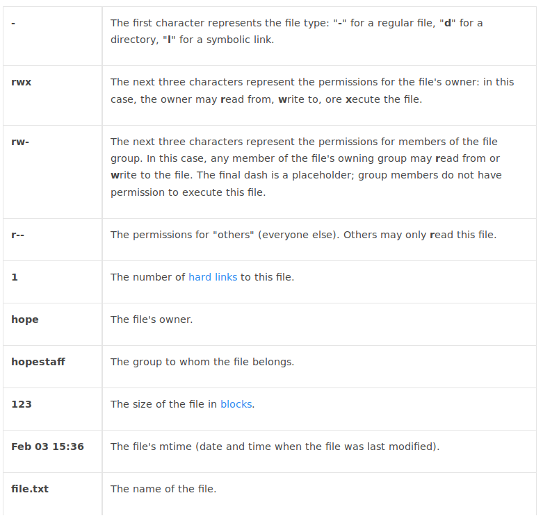

# 内容概要

# 参考文献
1. [difference-between-man-and-info](http://www.differencebetween.net/technology/software-technology/difference-between-man-and-info/)
1. [Linux Tools Quick Tutorial](https://linuxtools-rst.readthedocs.io/zh_CN/latest/base/01_use_man.html)
1. [whatis command returns nothing appropriate](https://superuser.com/questions/666551/apropos-on-arch-returns-nothing-appropriate-no-makewhatis-command)
1. [difference between which and whereis](https://superuser.com/questions/40301/which-whereis-differences)
1. [what is the xargs command in unix](https://shapeshed.com/unix-xargs/)
1. [differences-between-most-more-and-less](https://unix.stackexchange.com/questions/81129/what-are-the-differences-between-most-more-and-less)
1. [正则表达式文法](https://en.wikipedia.org/wiki/Regular_expression)
1. [difference-between-grep-egrep-and-fgrep](https://unix.stackexchange.com/questions/17949/what-is-the-difference-between-grep-egrep-and-fgrep)
1. [chmod用法](https://www.computerhope.com/unix/uchmod.htm)
1. [redirect-and-pipe](https://ryanstutorials.net/linuxtutorial/piping.php)

# 1. 学会使用命令帮助
在Linux终端，面对命令不知道怎么用，或不记得命令的拼写及参数时，我们需要求助于系统的帮助文档； linux系统内置的帮助文档很详细，通常能解决我们的问题，我们需要掌握如何正确的去使用它们。
## 1.1 查看命令的简要说明
使用 *whatis \<command\>* 命令查看命令的简要说明（显示命令所处的man分类页面）
```sh
$ whatis whatis
whatis (1)           - display one-line manual page descriptions
```
>如果 *whatis* 命令总是返回"nothing appropriate",请运行*sudo mandb*

在 *whatis* 命令后面，还可以添加参数 -w来使用正则表达式
```sh
$ whatis -w "rm*"
rm (1)               - remove files or directories
rmdir (1)            - remove empty directories
rmdir (2)            - delete a directory
rmmod (8)            - Simple program to remove a module from the Linux Kernel
rmt (8)              - remote magnetic tape server
rmt-tar (8)          - remote magnetic tape server
```
## 1.2 查看更详细的说明文档
我们可以使用 *man \<command\>* 或者 *info \<command\>* 命令查看详细的说明文档。
```sh
$ man info
$ info man
```
在man的帮助手册中，将帮助文档分为了9个类别
>(1). 用户可以操作的命令或者是可执行文件\
(2)、系统核心可调用的函数与工具等
\
(3)、一些常用的函数与数据库
\
(4)、设备文件的说明
\
(5)、设置文件或者某些文件的格式
\
(6)、游戏
\
(7)、惯例与协议等。例如Linux标准文件系统、网络协议、ASCⅡ，码等说明内容
\
(8)、系统管理员可用的管理条令
\
(9)、与内核有关的文件

对于有多个类别的命令，我们就需要使用*man \<k> command*指定类别来查看
```sh
$ whatis printf
printf (3)           - formatted output conversion
printf (1)           - format and print data
$ man 3 printf
```
> info与man两个命令之间有什么区别呢 ？
> 1. info的输出比man包含更多的信息 
> 1. man更老且逐渐别info所取代
> 1. 当info找不到文档说明时可以使用man
> 1. man的输出是一页而info是多页
> 1. info允许navigation但man不允许 
## 1.3 查看路径
我们可以使用 *which \<command\>* 定位一个命令对应的二进制文件
```sh
$ whatis which
which (1)            - locate a command
$ which make
/usr/bin/make
```
还可以使用 *whereis \<command\>* 查看更详细的内容，包括命令的二进制文件、源码、manual page的路径名
```sh
$ whatis whereis
whereis  -  locate the binary, source, and manual page files for a command
```

# 2. 文件及目录管理
## 2.1 创建和删除目录
### 2.1.1 创建目录
使用 *mkdir \<folder\>* 命令创建目录
```sh
$ mkdir temp
```
### 2.1.2 删除目录和文件
使用 *rmdir \<folder\>* 命令删除空目录
```sh
$ rmdir temp
```
使用 *rm \<file\>* 命令删除文件
```sh
$ vim hello.h
$ rm hello.h
```
使用 *rm -rf \<folder\>* 命令删除非空目录
```sh
$ mkdir temp;
$ vim temp/hello.h
$ cd ..
$ rm -rf temp
```
## 2.2 移动和复制目录和文件
```sh
$ mkdir parent1;mkdir parent2
$ mkdir parent1/child1;mkdir parent2/child2
$ vim parent1/child1/file1.h
$ vim parent2/child2/file2.h
```
使用 *mv \<src\> \<dst\>* 命令移动目录或文件
```sh
$ mv parent1/child1 parent2/child1
```
使用 *cp \<src\> \<dst\>* 命令复制文件
```sh
$ cp parent2/child1/file1.h parent2/child2/file1.h
```
使用 *cp -r \<src\> \<dst\>* 命令复制目录
```sh
$ cp -r parent2/child1 parent1/child1
```
## 2.3 目录切换
显示当前路径
```sh
$ pwd
/home/ksc
```
切换到其他目录
```sh
$ cd <dir>
```
> 几个常用目录缩写
> * home目录：～
> * 上一个工作目录：-
> * 根目录：/

## 2.4 列出目录项
显示当前目录下的文件
```sh
$ ls
doc/  README.md  src/
```
显示当前目录下的所有文件（包含隐藏文件）
```sh
$ ls  -a
./  ../  doc/  .git/  .gitignore  README.md  src/
```
按修改时间排序，以列表的方式显示目录项
```sh
$ ls -lrt
total 12
-rw-r--r-- 1 ksc ksc  135 Mar  1 15:28 README.md
drwxr-xr-x 3 ksc ksc 4096 Mar  2 13:06 src/
drwxr-xr-x 3 ksc ksc 4096 Apr  2 14:33 doc/
```
给每项文件前加上一个id编号
```
$ ls | cat -n
     1	doc
     2	README.md
     3	src
```
我们可以在.bashrc中设置命令别名
```sh
alias lsl = 'ls -lrt'
alias lm = 'ls -al|more'
```
> 在ls的参数中，l表示使用列表格式，r表示逆序，t表示按时间排序（newest first）。
```
cat (1)              - concatenate files and print on the standard output
more (1)             - filter for paging through text one screenful at a time
```

# 2.5 查找目录及文件 find/locate
搜寻文件或目录 find \<dir\> -name \<file-name\>
```sh
$ find ./ -name "*.md"
./README.md
./doc/Ubuntu-18.04安装与配置.md
./doc/Git学习（一）.md
./doc/Git学习（三）.md
./doc/Linux学习（一）.md
./doc/Git学习（二）.md
```
find命令可以配合-exec选项或xargs命令使用，实现从标准输入build一个execution pipeline
```sh
$ find ./ -name "*.md" | xargs file
$ find ./ -name "*.md" -exec file {} +
./README.md:                     UTF-8 Unicode text
./doc/Ubuntu-18.04安装与配置.md: UTF-8 Unicode text
./doc/Git学习（一）.md:          C++ source, UTF-8 Unicode text
./doc/Git学习（三）.md:          UTF-8 Unicode text
./doc/Linux学习（一）.md:        UTF-8 Unicode text
./doc/Git学习（二）.md:          C source, UTF-8 Unicode text
$ find ./ -mtime +54 | xargs ls -lrt
-rwxrwxrwx 1 ksc ksc  67567 Feb 28 17:05 ./doc/rc/project-snap.png
-rwxrwxrwx 1 ksc ksc  56632 Feb 28 17:13 ./doc/rc/git-workspace.png
-rwxrwxrwx 1 ksc ksc 140325 Mar  1 13:33 ./doc/rc/git-file-status-change.png
-rw-r--r-- 1 ksc ksc    135 Mar  1 15:28 ./README.md
```
find是实时查找，如果需要更快的查询，可试试locate；locate会为文件系统建立索引数据库，如果有文件更新，需要定期执行更新命令来更新索引库:
```
$ updatedb
$ locate "*.md"
```
相比于find, locate虽然快，但不是实时的，且只能按文件名查找，不能指定搜素路径。

## 2.6 查看文件内容
按页显示文件内容, 空格向后翻页，b向前翻页，回车向后翻一行，y向前翻一行
```sh
$ less <file-name>
```
可以加上参数-N来显示行号
```sh
$ less -N <file-name>
```
显示文件的前n行
```sh
$ head <-n> <file-name>
```
显示文件的后n行
```sh
$ tail <-n> <file-name>
```
查看两个文件间的差别
```sh
$ diff <file1> <file2>
```
动态显示文本最新信息
```
$tail -f crawler.log
```

# 2.7 查找文件内容 grep
```
grep (1)             - print lines matching a pattern
```
在文件/文件夹下查找给定字符串
```sh
$ grep -r 'main' /etc/group
```
找到的字符要match the whole word
```sh
$ grep -rw 'main' /etc/group
```
查找文件中出现的字符串，文件中出现的字符串要以新行分开
```sh
$ grep -rF -f keyword.txt /etc/group
```
使用扩展的正则语法，查找字符串
```sh
$ grep -rE '<regular expression>' /etc/group
```
正则表达式Example
* ```.at ``` ：任意以at结尾的三字符组
* ```[hc]at``` : “hat”和“cat”
* ```[^b]at``` :  ```.at ```能表示的字符组中除了“bat”
* ```[^hc]at``` : ```.at ```能表示的字符组中除了“hat”和“cat”
* ```^[hc]at``` : “hat”和“cat”,不过只能在一行或者字符串的开头（互相以新行或空格分开的叫字符串）
* ```[hc]at$``` :  “hat”和“cat”,不过只能在一行或者字符串的结尾
* ```\[.\]``` : 开头由[组成，结尾由]组成的任意三字符组
* ```s.*``` : 开头由s组成，后面跟零个或多个字符的字符组
* ```no(fork|group)```: "nofork"和“nogroup”

## 2.8 文件与目录权限修改
[什么是文件权限？](https://www.computerhope.com/unix/uumask.htm#filepermissions)
我们先查看一个文件的权限
```
$ ls -l file.txt
-rwxrw-r-- 1   hope   hopestaff  123   Feb 03 15:36   file.txt
```
下表解释了输出中每个参数的含义




可以用```chmod <options> <permissions> <filename>```来改变文件的权限
```sh
# u、g、o分别代表"user","group","other". r,w,x分别代表“read”,"write","execute"，”=“表示将这个文件在等于号右边的权限精确设置给等于号左边的群体。
chmod u=rwx,g=rx,o=r myfile
```
常见的，我们可以用利用8进制数来简化这条命令，将u,g,o所拥有的权限以一个8进制数表示，保持其顺序不变。8进制数由权限相加得到，其中r表示4，w表示2，x表示1。上面的命令等价于
```sh
chmod 754 myfile
```
我们还以加上-R参数递归地改变文件夹及其下文件的权限
```sh
chmod 755 myfold
```
## 2.9 命令连接、重定向和管道
### 2.9.1 命令连接
* 串联: 使用分号 ;
* 前面成功，则执行后面一条，否则，不执行:&&
* 前面失败，则后一条执行: ||
```sh
$ ls /proc && echo  suss! || echo failed.
```
与上述相同效果的是
```sh
$ if ls /proc; then echo suss; else echo fail; fi
```
### 2.9.2 重定向和管道
```
>   保存输出到文件
>>  append输出到文件
<   从文件读输入
2>  重定向error信息
|   将一个程序的输出作为另一个程序的输入
```
* STDIN (0) : 标准输入（feed给程序的数据）
* STDOUT (1) : 标准输出（程序输出的data,默认到terminal）
* STDERR (2) : 标准Error(输出的错误信息，默认到terminal)

重定向标准输入输出
```sh
$ ls > output-file # 将ls输出保存到output-file
$ ls >> output-file # 将ls输出append到output-file
$ wc -l output-file  # 数output-file中的行数
8 output-file
$ wc -l < output-file # 相比于上一条命令，data是匿名传输的
8
$ wc -l < output-file > another-file # 将<与>/>>结合使用
$ cat another-file # 输出another-file的内容
8
$ :> another-file # 清空another-file中的内容
```
重定向标准Error
```sh
$ ls -l video.mpg blah.foo # 列出文件的各种属性
ls: cannot access blah.foo: No such file or directory
-rwxr--r-- 1 ryan users 6 May 16 09:14 video.mpg
$ ls -l video.mpg blah.foo 2> errors.txt # 重定向标准Error到文件
-rwxr--r-- 1 ryan users 6 May 16 09:14 video.mpg
$ cat errors.txt # 输出errors.txt文件的内容
ls: cannot access blah.foo: No such file or directory
```
重定向标准输出和标准Error到文件
```sh
$ ls -l video.mpg blah.foo > errors.txt 2>&1 # 先重定向标准输出到文件,再重定向标准Error到标准输出， &符号是为了防止标准Error被重定向到名为1的文件
$ cat errors.txt #输出errors.txt文件的内容
ls: cannot access blah.foo: No such file or directory
-rwxr--r-- 1 ryan users 6 May 16 09:14 video.mpg
```
管道
```sh
$ ls # 列出当前文件夹下的非隐藏文件
barry.txt bob example.png firstfile foo1 myoutput video.mpeg
$ ls | head -3 # 显示前三个
barry.txt
bob
example.png
$ ls | head -3 | tail -1 # 显示第三个
example.png
```

## 2.10 综合应用
查找record.log中包含AAA，但不包含BBB的记录的总数
```sh
$ cat -v record.log | grep AAA | grep -v BBB | wc -l
```