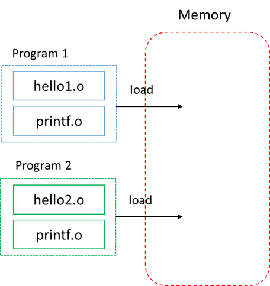

# 内容概要
1. 什么是编译系统，什么是Driver?
1. 编译系统在翻译代码的四个阶段都干了什么，分别要给Driver什么选项？
1. 汇编代码有哪两种格式，二者有什么区别？
1. `mov`指令的简单介绍
1. 对于汇编文件和目标文件代码不一致的简单解释
1. 什么是库？静态库与动态库的区别？
1. 为什么编译系统分成4个部分？

# 参考文献
1. [clang command guide](https://clang.llvm.org/docs/CommandGuide/clang.html)
1. `<<Computer System>>`
1. `<<自己动手构造编译系统>>`
1. [what is a c library?](https://en.wikibooks.org/wiki/C_Programming/Libraries)
1. [create shared libraries with gcc](https://www.cprogramming.com/tutorial/shared-libraries-linux-gcc.html)
1. [Linux中的动态链接库和静态链接库是干什么的？](https://www.zhihu.com/question/20484931)
1. [where can you find c standard library?](https://stackoverflow.com/questions/5925678/location-of-c-standard-library)
1. [Preprocessor output](https://gcc.gnu.org/onlinedocs/gcc-9.1.0/cpp/Preprocessor-Output.html#Preprocessor-Output)

# 1. 什么是编译系统？
计算机系统是由硬件和软件组成的，它们共同工作来运行应用程序。计算机硬件只能识别由0和1组成的二进制代码，也即机器语言。因此，当我们写出一个如下的"Hello Word"源程序时，
```C
// hello.c
#include <stdio.h>
int main() {
    printf("Hello, World\n");
    return 0;
}
```
如果想要它能被计算机硬件执行，必须要将这个源文件（文本文件）转化为可执行文件（二进制文件），而**编译系统**就是完成这个转换的工具。

在Unix系统上，从源文件到可执行文件的转化是由Driver完成的
```bash
$ clang hello.c -o hello
```
这里`clang`就是Driver,它读取源文件`hello.c`，并将其翻译为可执行文件`hello`,这个翻译过程可分为4个阶段，如下图所示


执行这四个阶段的程序（预处理器、编译器、汇编器、链接器）一起构成了编译系统，Driver就是驱动着这四个程序运行的工具。

# 2. 四个阶段的工作
## 2.1 预处理阶段
预处理器(cpp)根据以字符`#`开头的命令，修改原始的C程序，比如将被`#include`的头文件的插入，将宏展开，根据`#ifdef`进行代码选择等等。
在`hello.c`中，第一行的`#include<stdio.h>`命令告诉预处理器读取系统头文件`stdio.h`的内容，并把它直接插入到程序文本中，结果就得到了另一程序，通常以`.i`作为扩展名。

我们可以使用`-E`选项来让clang只跑预处理阶段
```bash
$ clang hello.c -E -o hello.i
```
```C
// hello.i
...
extern int printf (const char *__restrict __format, ...);
...
#include <stdio.h>
int main() {
    printf("Hello, World\n");
    return 0;
}
```
## 2.2 编译阶段
编译器(cc1)将文本文件`hello.i`翻译成文本文件`hello.s`,对于clang而言，在将`hello.i`翻译成`hello.s`之前，还会将先翻译成LLVM IR。我们可以使用`-S`选项让clang跑到编译阶段
```bash
$ clang hello.c -S -o hello.s # 也可以把输入换成hello.i
```
```x86asm
main:                                   # @main
        pushq   %rbp
        movq    %rsp, %rbp
        subq    $16, %rsp
        movl    $0, -4(%rbp)
        movabsq $.L.str, %rdi
        movb    $0, %al
        callq   printf
        xorl    %ecx, %ecx
        movl    %eax, -8(%rbp)          # 4-byte Spill
        movl    %ecx, %eax
        addq    $16, %rsp
        popq    %rbp
        retq
.L.str:
        .asciz  "Hello, World\n"
```
`hello.s`包含一个汇编语言程序，汇编语言以文本格式描述了低级机器指令，为不同的高级语言的不同编译器提供了通用的输出语言。clang默认生成的汇编代码的语法是`ATT`格式，如果想生成`intel`格式的汇编代码，可以使用参数`-masm=intel`。
```bash
$ clang hello.c -S -masm=intel -o hello.s # 也可以把输入换成hello.i
```
```x86asm
main:                                   # @main
        push    rbp
        mov     rbp, rsp
        sub     rsp, 16
        mov     dword ptr [rbp - 4], 0
        movabs  rdi, offset .L.str
        mov     al, 0
        call    printf
        xor     ecx, ecx
        mov     dword ptr [rbp - 8], eax # 4-byte Spill
        mov     eax, ecx
        add     rsp, 16
        pop     rbp
        ret
.L.str:
        .asciz  "Hello, World\n"
```
我们先介绍条指令`movb $0, %al`， 其中`movb`是`mov`指令的一个版本，`mov`指令是用来在寄存器和内存间传输数据，后缀`b`表示操作数的大小是1个byte，当然相应的还有`movw`、`movl`,`movq`分别对应操作数是1个word(16-bit)，一个long word(32-bit)和一个quad word(64-bit)。

`$0`是源操作数，`%al`是目标操作数，`$`前缀表示操作数是一个立即数。`%`表示操作数是一个寄存器，这里的`$`和`%`都称为操作数指示符。`%al`是一个8-bit的寄存器，其实也是64-bit寄存器`%rax`的低8位。

`movb $0, %al`指令就表示将立即数`0`放入寄存器`al`中，对应的`intel`指令是`mov al, 0`，可以看出intel和`ATT`在如下方面有所不同：
* intel代码省略了指示操作数大小的后缀
* intel代码省略了立即数的前缀`$`，寄存器名的前缀`%`
* intel的源操作数在后，目标操作数在前

类似的，`movl $0, -4(%rbp)`表示，将寄存器`rbp`中的值减去`4`的结果作为指向内存的地址，将立即数`0`放到那片内存中去。不难看出，其对应的C语言中的指针解引用`*(p-4)=0` (p是一个指针)。相应的intel汇编代码是
` mov dword ptr [rbp - 4], 0`,可以看出
* intel代码用不同的方式描述内存中的位置，并且显式地使用`ptr`指出操作数是一片内存。

## 2.3 汇编阶段
汇编器(as)将`hello.s`翻译成机器语言指令，把这些指令打包成可重定位目标文件。我们可以使用`-c`选项让clang运行到汇编阶段
```bash
$ clang hello.c -c -o hello.o # 也可以把输入换成hello.i或hello.s
```
目标文件是二进制文件，无法用文本编辑器直接查看，但是我们可以使用`objdump`命令分析它地内容
```bash
$ objdump -sd hello.o
```

```x86asm
hello.o:     file format elf64-x86-64

Contents of section .rodata.str1.1:
 0000 48656c6c 6f20576f 726c640a 00        Hello World..

Disassembly of section .text:

0000000000000000 <main>:
   0:   55                      push   %rbp
   1:   48 89 e5                mov    %rsp,%rbp
   4:   48 83 ec 10             sub    $0x10,%rsp
   8:   c7 45 fc 00 00 00 00    movl   $0x0,-0x4(%rbp)
   f:   48 bf 00 00 00 00 00    movabs $0x0,%rdi
  16:   00 00 00
  19:   b0 00                   mov    $0x0,%al
  1b:   e8 00 00 00 00          callq  20 <main+0x20>
  20:   31 c9                   xor    %ecx,%ecx
  22:   89 45 f8                mov    %eax,-0x8(%rbp)
  25:   89 c8                   mov    %ecx,%eax
  27:   48 83 c4 10             add    $0x10,%rsp
  2b:   5d                      pop    %rbp
  2c:   c3                      retq
```
从数据段二进制信息的ASCII形式地显示中，我们看到汇编语言内定义的字符串数据`"Hello World\n"`。代码段的信息和汇编文件代码信息基本吻合，但是有一些看起来奇怪的变化。

比如，在汇编文件中`movabsq $.L.str, %rdi`是将字符串`"Hello World\n"`的地址放在了`%rdi`中，而在目标文件中的对应代码`movabs $0x0,%rdi`竟然将源操作数换成了`0`。在汇编文件中`callq printf`是调用`printf`函数，而在目标文件中对应的代码`callq 20 <main+0x20>`调用的是`main`函数偏移20字节的的函数，看一下可以发现竟然就是下一条指令的位置！

这个奇怪的现象本质上来源于汇编语言符号的引用问题，汇编器在处理当前文件的过程中无法获取符号的的虚拟地址，因此会将这些符号地址设成一些临时值(比如0，下一条指令的地址等)，真正的符号地址只有在链接时才能确定。


## 2.4 链接阶段
`hello`程序带调用了`printf`函数，它是每个C编译器都提供的标准C库中的一个函数，printf函数存在于一个名为`printf.o`的单独预编译好了的目标文件中，而这个文件必须某种方式与hello.o文件合并，链接器(ld)就负责处理这种合并，得到可执行目标文件`hello`。

当我们不使用除`-o`外的其他参数，clang就会执行到链接阶段，默认是动态链接的，如果需要静态链接，需要加上`-static`选项
```bash
$ clang hello.c  -o hello # 也可以把输入换成hello.i或hello.s或hello.o
$ clang hello.c -static -o hello # 静态链接
```
我们使用`objdump -sd hello`看一下链接后的可执行文件的信息
```x86asm
0000000000400db0 <main>:
  400db0:       55                      push   %rbp
  400db1:       48 89 e5                mov    %rsp,%rbp
  400db4:       48 83 ec 10             sub    $0x10,%rsp
  400db8:       c7 45 fc 00 00 00 00    movl   $0x0,-0x4(%rbp)
  400dbf:       48 bf 90 f7 48 00 00    movabs $0x48f790,%rdi
  400dc6:       00 00 00
  400dc9:       b0 00                   mov    $0x0,%al
  400dcb:       e8 70 0d 00 00          callq  401b40 <_IO_printf>
  400dd0:       31 c9                   xor    %ecx,%ecx
  400dd2:       89 45 f8                mov    %eax,-0x8(%rbp)
  400dd5:       89 c8                   mov    %ecx,%eax
  400dd7:       48 83 c4 10             add    $0x10,%rsp
  400ddb:       5d                      pop    %rbp
  400ddc:       c3                      retq
  400ddd:       0f 1f 00                nopl   (%rax)
```
可以发现，在汇编过程中的无法确定的符号地址信息都被修正为实际的符号地址。如`"Hello World\n"`的字符串地址为`0x48f790`,`printf`的地址为`401b40`。

# 3. 库的简单介绍
## 3.1 C语言中的库是什么？
C语言中的库是一组函数、宏、结构体等提供了某些功能的代码的集合。这些功能的接口（就是暴露给user的东西）通常会放在头文件中，你想要使用这些功能就需要`#include`相应的头文件（譬如`stdio.h`就是标准输入输出库对应的头文件）。如果库提供源码的话，这些功能的实现通常会在对应的`.c`文件中（当然也有可能直接放在被`#include`的头文件里），库的代码会和你自己的代码一起经历预处理、编译、汇编、链接的过程。如果不提供源码的话，这些功能的实现就会被打包成一个单独的文件，直接作为链接器的输入的一部分。

我们通常说库时，指的都是被打包的功能的实现，下面我们也会采用这种说法。

## 3.2 库的分类
库通常分为两种：静态库和动态库，在Unix上分别对应`.a`和`.so`文件（在Windows上分别对应`.lib`和`.dll`文件）。库是直接作为链接器的输入的，因此静态和动态指的是两种链接方法，二者的区别这里会先做一个简单介绍，在后面实现链接器的时候我们会进行详细的剖析。


静态库是一组连接起来的可重定位目标文件(`.o`文件)的集合，我们称这种格式为存档(archive)，存档有一个头部用来描述每个成员目标文件的大小和位置，存档文件名由`.a`标识。在链接时，链接器会复制被程序引用到的`.o`文件，将其与程序的`.o`文件一起打包到可执行文件中。譬如说，你可以在`/usr/lib`文件下找到`libc.a`文件，使用
```bash
$ ar -t libc.a
```
你可以看到它由很多`.o`文件组成，当你使用`clang hello.c -static -o hello`命令时，链接器便会复制其中的`printf.o`等模块到的部分到可执行文件`hello`中去。程序运行时，可执行文件会被加载到内存中，如下图所示



不难看出，静态库（`.a`文件）具有以下特点
* 一旦可执行文件生成，就不再对库有依赖，也就是说只要developer有相应的库就好，user不需要
* 浪费磁盘空间和内存，当多个程序都需要用到这个库时，该库在内存中会有多份拷贝
* 对程序的更新和发布带来麻烦，一旦静态库更新了，整个程序就需要重新链接生成一个新的可执行文件，用户想要更新就需要整个程序重新下载（全量更新）。

为了解决上述问题，现代编译系统引入了动态库，链接器不会将动态库（`.so`文件）内的目标文件合并到可执行文件内，而仅仅记录动态库的路径信息。链接器可以在程序运行前才加载所需要的动态库，如果该动态库已加载到内存，则不需要重复加载。另外，链接器也可以将程序执行库函数调用的那一刻才进行动态库的加载。因此，磁盘和内存空间的浪费被避免了，并且如果动态库更新了，用户只需要更新该动态库即可（增量更新）。

当然，动态库也有缺点
* 运行时链接的方式会增加程序执行的时间开销
* 动态库的版本错误可能会导致程序无法执行

# 4. 为什么要这么麻烦？
你可能会想，为什么不直接一步生成可执行文件，而是让分开进行预处理、编译、汇编、链接四个步骤呢？

预处理只是将源文件进行修改，譬如头文件的插入，代码的选择，输出的`.i`文件中的代码基本都是C语言的语法(不是C语言的语法见[Preprocessor output](https://gcc.gnu.org/onlinedocs/gcc-9.1.0/cpp/Preprocessor-Output.html#Preprocessor-Output))，然后编译器处理被展开后的C文件。因此，预处理器和编译器的分开是一个自然的、模块化的设计。

汇编语言的每一条语句都以文本格式描述了一条低级机器语言指令，因此汇编语言不但为不同的高级语言的不同编译器提供了通用的输出语言，还能让我们间接地读懂机器实际执行的指令，所以我们需要将编译器和汇编器分开。

为什么我们需要链接器呢？

有了链接器，我们就可以把代码写在多个文件中，而不是一个单一文件的庞然大物。而可以把代码写在多个文件中可以带来很多好处。
* 首先，代码的复用更加方便（否则就要把需要功能的code复制到唯一的源文件中）。
* 其次，我们可以进行分离式编译，改变一个源文件后只需重新编译该源文件得到`.o`文件，再与其他`.o`文件链接即可，而不用重新编译其他源文件，节省了时间
* 再者，当我们实现了很多功能，但是程序只需要其中一部分的时候，我们可以只链接我们所需要用到的功能的代码所在的`.o`文件，这样需要加载到内存中的内容就变少了，节省了空间。 